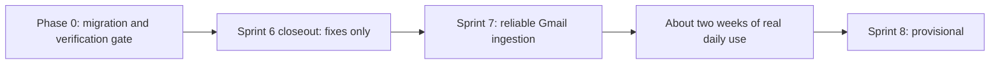

# Planning index and roadmap — after Sprint 6

Status: **office implementation updated 2026-10-03.** Sprint 7 is implemented locally; Sprint 8 correction/recovery and bounded Google transport are implemented locally, while live Gemini certification is blocked. See [Sprint 7 evidence](sprint-7/execution-report.md) and [Sprint 8 evidence](sprint-8/execution-report.md). The 2026-10-02 audit below is historical where implementation notes supersede it. All IDs are local; no Linear identity, state, estimate or approval is assumed. Linear sync happens only after the [migration verification gate](migration-verification/README.md) passes and the tickets are reviewed.

Source of truth for this plan: a read-only audit of the current code in all three folders, with every gap re-checked by an independent verifier. The findings and where each one went are in the [state audit](state-audit-2026-10-02.md). Code was treated as the truth; where docs disagree, the docs are wrong and a ticket fixes them.

## 1. Where things stand

| Area | State in the office checkout (2026-10-03) | Evidence today |
| --- | --- | --- |
| Sprint 6 (S6-01..S6-05) | Implemented. Review fixes S6-R01..S6-R06 done. S6-R07 rematch guard implemented as the concrete S8-01 prerequisite. S6-R08 partly open (item 3 was fixed by BYO AI). | Old laptop only: backend 621 and frontend 154 tests, three migration lanes, real-worker smoke. |
| BYO AI (ADR-0001) | AI-00..AI-14 and AI-16 implemented. All three providers are `hidden`: usable in dev and test, never offered in production. AI-15, AI-17, AI-18 open. No live provider call ever made. | Same as above; no live evidence. |
| MCP (ADR-0002) | MCP-00..MCP-07 and MCP-09 part A implemented and matching ADR-0002. MCP-08 staged as text. MCP-09 part B (Antigravity) not run. Only the official SDK client has called the real `/mcp`. | Same as above; no real-client evidence. |
| Sprint 5 Gmail reliability (S5-FU-01/S5-FU-02) | Crash fencing, request bounds/cancellation and minimal sync events implemented locally. Expanded counters remain deferred. | Real SIGKILL/redelivery, loopback transports and all three preservation lanes; see execution reports. |
| Twice-daily scheduled sync (locked 2026-10-01) | Implemented: 00:00/18:00 Asia/Kolkata, startup/missed-slot catch-up. | Local queue tests and smoke pass; two real-day observation pending. |
| Source control | Existing full-history Git checkouts synchronized from GitHub; local milestone commits on `feat/sprint-7-8-reliability`. Downloads excluded. | Current GitHub account has no repository push permission; publication pending. |
| CI and deployment | CI workflows implemented locally; deployment remains planned. | Local checks pass; no GitHub CI run or green-on-main claim. |

**Sprint 6 can be called implementation-complete.** The code matches the execution reports, and the audit found no critical or high defect. It cannot yet be called *accepted*: every result was measured on the old laptop only, the live Gmail/original-data entry gate is still open, two review tickets are open, and several Done claims rest on tests that do not prove them.

## 2. Order of work

1. **[Phase 0 — migration and verification](migration-verification/README.md).** Not a sprint. Move the repos, restore git, rebuild the environment, run migrations and every existing check, then verify BYO AI and MCP by hand. Fix only what the move broke. Everything else becomes a ticket.
2. **[Sprint 6 closeout](sprint-6/closeout/README.md).** Fixes only, no features, about 2.5 to 3 weeks. It finishes and stabilizes Sprint 6, BYO AI and MCP, and records acceptance from new-PC evidence.
3. **[Sprint 7 — reliable Gmail ingestion](sprint-7/README.md).** Mail is never silently skipped, a crash cannot fake a successful sync, dates are not invented, and sync runs twice a day without a click. CI guards every change.
4. **[Sprint 8 — correctable and recoverable results](sprint-8/README.md)** (provisional). Planned again after Sprint 7 and about two weeks of daily use. If the owner decides to deploy first, the [release track](#7-release-track-not-scheduled) replaces it.

No future-sprint work starts before the Phase 0 gate passes.

## 3. Ticket index

| ID | Title | Where | Size |
| --- | --- | --- | --- |
| MV-01..MV-16 | Migration and verification checklist | [Phase 0](migration-verification/README.md) | — |
| [AI-19](byo-ai/AI-19-runtime-safety-fixes.md) | BYO AI runtime safety fixes for daily use | Closeout | M |
| [AI-20](byo-ai/AI-20-recovery-path-and-status-ui.md) | BYO AI: reachable recovery path and honest status UI | Closeout | L |
| [S6-R07](sprint-6/review-2026-10-02/S6-R07-guard-automatic-rematch.md) | Guard automatic re-matching of already matched emails (existing) | Closeout | S |
| [S6-C01](sprint-6/closeout/S6-C01-make-done-claims-provable.md) | Make the Done claims provable: tests and lanes | Closeout | M |
| [S6-R08](sprint-6/review-2026-10-02/S6-R08-ux-contract-polish.md) | UX, accessibility and contract polish (existing, amended) | Closeout | S |
| MCP-08 + MCP-09 part B | Apply the automation-repo changes and finish the Antigravity walkthrough (existing, amended) | Closeout (owner) | S |
| [MCP-10](mcp-feature/MCP-10-post-verification-corrections.md) | MCP corrections after real-client verification | Closeout | M |
| [S6-C02](sprint-6/closeout/S6-C02-docs-truth-and-acceptance-records.md) | Docs match the code; record Sprint 6, BYO AI and MCP acceptance (last) | Closeout | L |
| [S7-01](sprint-7/S7-01-ci-and-toolchain-pins.md) | Minimal CI for backend and frontend, with toolchain pins | Sprint 7 | M |
| [S7-02](sprint-7/S7-02-no-silent-mail-loss-after-gaps.md) | Never skip mail when the gap since the last sync is longer than the lookback | Sprint 7 | M |
| [S7-03](sprint-7/S7-03-safe-action-deadlines.md) | Store AI action deadlines only when the date is clear | Sprint 7 | M |
| [S7-04](sprint-7/S7-04-worker-startup-and-readiness.md) | Background workers recover or fail loudly, and report readiness | Sprint 7 | S |
| [S5-FU-01](sprint-5/follow-up-gmail-reliability.md) | Gmail sync fencing and crash recovery (existing, rescoped) | Sprint 7 | L |
| [S7-05](sprint-7/S7-05-twice-daily-scheduled-sync.md) | Twice-daily scheduled Gmail sync | Sprint 7 | M |
| [S8-01](sprint-8/S8-01-correct-a-wrong-email-match.md) | Let the user correct a wrong email match (ADR-0003 first) | Sprint 8 | L |
| [S8-02](sprint-8/S8-02-recover-stuck-and-waiting-emails.md) | Recover stuck and waiting emails without an operator | Sprint 8 | S |
| [AI-15](byo-ai/AI-15-certify-gemini-first.md) | Certify Gemini first (existing, widened) | Sprint 8 | M |
| [S5-FU-02](sprint-5/follow-up-google-request-bounds.md) | Bound every Google and Gmail request | Sprint 8 | M |

Existing tickets keep their IDs (S6-R07, S6-R08, S5-FU-01, AI-15, MCP-08). New IDs come only from unused ranges. No COM number is assigned.

## 4. MCP: where verification and productionization go

- **Verification is Phase 0, not a sprint.** On the new PC: re-run the backend MCP tests, the MCP migration lane and the smoke (MCP-09 part A), then the first real-client check — `scripts/mcp-client-check.cjs` against the dev server, then Antigravity connect, list and call — on a throwaway database and user ([MV-14](migration-verification/README.md#mv-14--verify-mcp-with-real-clients)).
- **Finishing MCP is closeout work.** MCP-08 needs the `job-application-automation` repo; MCP-09 part B steps 3–5 need MCP-08 applied. [MCP-10](mcp-feature/MCP-10-post-verification-corrections.md) holds the small fixes found by the review and by the real-client run.
- **No MCP work belongs in Sprint 7 or Sprint 8.** The audit found the MCP code sound: hashed single-scope tokens, Bearer-only, Host/Origin checks, per-user isolation with database triggers, idempotent replay under a per-user lock, no side effects beyond create or link plus one event, identical contracts, unchanged matcher and `deriveStatus`.
- **Productionization waits for a deployment decision** ([release track](#7-release-track-not-scheduled)): edge routing for `/mcp`, `MCP_ALLOWED_HOSTS` set to the real Host, per-token limits. Before anyone except the owner uses MCP, applications created by automation must become removable (OD-10).

## 5. BYO AI: what blocks "production-ready"

BYO AI is implemented and safe by default (hidden providers are refused in production). It is not production-ready. In risk order:

1. **No evidence on the new PC yet** → Phase 0 (MV-08..MV-10, MV-13).
2. **Runtime gaps that matter once a real key is used daily** — a systematic provider 400 fails every email with no bound; an env flag can switch Gemini to Vertex mode; the Gemini SDK is not exactly pinned; two first-time saves at once return 500; save/check can outlast the client deadline; the consent text understates when email text is sent → [AI-19](byo-ai/AI-19-runtime-safety-fixes.md).
3. **The only recovery path for held operations is not reachable by keyboard or touch**, and some status copy is wrong → [AI-20](byo-ai/AI-20-recovery-path-and-status-ui.md).
4. **Done claims without proof** (AI-16 job-table scan, production gating, AI-11/12 tests) → [S6-C01](sprint-6/closeout/S6-C01-make-done-claims-provable.md), [AI-20](byo-ai/AI-20-recovery-path-and-status-ui.md).
5. **Stale docs** still describe a hosted Gemini key and a global budget → [S6-C02](sprint-6/closeout/S6-C02-docs-truth-and-acceptance-records.md).
6. **No provider is certified**, so a production build has no AI at all. Gemini certification had no owning ticket, and the evaluation runner scores rate limits as quality failures → [AI-15](byo-ai/AI-15-certify-gemini-first.md), widened to Gemini first (Sprint 8).
7. **Release itself** (AI-17 live run, zero-provider empty state, shutdown deadline) waits for a deployment decision. AI-18 waits for one stable release.

Locally the owner can use BYO AI right after Phase 0, because hidden providers are offered outside production.

## 6. Owner decisions

Each decision has a recommendation. A decision blocks only the work named in its row.

| ID | Decision | Recommendation | Needed before |
| --- | --- | --- | --- |
| OD-01 | Sprint 6 entry gate: the live Gmail and original-data evidence cannot be produced from current code. | Close Sprint 6 for engineering. Move the gate, unchanged, into a named pre-release gate that runs after S5-FU-01 and S5-FU-02. Record it as "moved by owner", not "passed". Do not retire original-data preservation: its part needs FU-5 and applies only if OD-13 finds the dataset. | S6-C02 acceptance record |
| OD-02 | System of record after the move. | Git/GitHub plus local markdown with local IDs. Linear only as an optional mirror of reviewed tickets. Amend PROJECT_CONSTITUTION to describe how work is actually done (Claude Code implements; Done = committed, tests green, evidence recorded). | Linear sync; S6-C02 |
| OD-03 | Shape of the restored git history. | One branch per repo with layered commits from the checksummed snapshots (backend/frontend: Sprint 6 → BYO AI → final; docs: BYO AI → final), after finding each zip's base commit. | MV-03 |
| OD-04 | What a sync does after a gap longer than the lookback. | Scan since the last successful sync, capped at 30 days; tell the user when the cap cut mail. | S7-02 |
| OD-05 | Timezone and missed runs for the twice-daily sync. | One configured timezone, `Asia/Kolkata`, for 00:00 and 18:00. On start-up, run one catch-up sync if a slot was missed. No per-user timezones. | S7-05 |
| OD-06 | Deadline dates without a year. | Infer the year from the email's received date (next occurrence on or after it, with one day of tolerance for senders behind UTC); store null for anything else unclear. Keep date-only deadlines date-only. | S7-03 |
| OD-07 | Wrong-match correction policy (ADR-0003). | Allow move and unlink for matched emails (auto- or user-matched), and link for ignored emails. Retire, never delete, the old application's event and actions with a reason. Recompute `aiStatus`; never touch `userStatus`. | S8-01 |
| OD-08 | Deploy before Sprint 8? | No. Stay local and owner-only. When you decide to deploy, run the release track instead of Sprint 8. | Sprint 8 choice |
| OD-09 | BYO AI V1 providers and data-use approval. | Gemini only for V1. OpenAI and Claude stay hidden. Approve the data-use text only after AI-19 corrects it; bump `disclosure.version` with the approval. | AI-15 catalog change |
| OD-10 | Undo for applications created by automation. | For owner-only use, accept CLOSED as the workaround and run live with a low `MCP_DAILY_SUBMISSION_LIMIT`. Require archive/undo before anyone else uses MCP. | Wider MCP use only |
| OD-11 | If Antigravity sends `Origin: null` (found in MV-14). | Decide only if it happens. Prefer an opt-in setting, off by default, that accepts a literal `null` Origin only with a valid Bearer token and an allowed Host; record it as an ADR-0002 amendment. | MCP-10, MCP-09 part B |
| OD-12 | S6-R08 malformed dates. | Validate the three runtime-checked application date fields as ISO strings, so a bad date becomes the recoverable contract error that Sprint 6 DoD item 7 requires. | S6-R08 |
| OD-13 | Does the original ~1,620-email dataset still exist (MV-02)? | If not found, drop S5-FU-01 FU-5 (snapshot tooling) from planning and record the original-data part of the moved gate as not applicable (dated). Keep the preservation rule for any real database restored later. | FU-5 scheduling |
| OD-14 | How AI-19 stores the per-user pause after repeated provider rejections (INVALID_REQUEST). | Add `PAUSED` to the stored `AIAccessIssue` enum (one additive migration) and show the existing `PAUSED` access reason. No API or label change. | AI-19, AI-20 item 22 |
| OD-15 | How S5-FU-02 stops the token refresh that runs on every Gmail 403. | Store the access-token expiry (one nullable column) so the library refreshes before expiry and never on 401/403. | S5-FU-02 |

## 7. Release track (not scheduled)

Runs only when the owner decides to deploy (OD-08). It replaces Sprint 8 at that point and gets full tickets then. Outline, at most five tickets:

1. **Hosting decision and deploy path (ADR-0004).** The smallest host that fits the architecture: one API+worker process, managed PostgreSQL 15, frontend on the same origin, TLS. Decide whether `/mcp` is exposed (default: no) and the Google OAuth publishing status. Scripted deploy, migrate at deploy, one tested backup restore, written rollback. Reconcile with the AWS design in [high-level architecture §9](../architecture/high-level-architecture.md), whose cost estimate is about $63–100 per month.
2. **Production configuration and request hardening.** Dev auth only in development/test; require `TRUST_PROXY_HOPS` and the OAuth/Gmail settings in production; security headers, a basic rate limit, Origin check on cookie-authenticated writes, no GET logout; client body errors as 4xx; one shared `FRONTEND_URL` default; per-token `/mcp` limits if exposed.
3. **Deploy-safe shutdown.** A shutdown deadline longer than one job's worst-case provider time; close the pool; never strand a paid call silently.
4. **AI-17 supervised release**, with the zero-provider empty state on `/ai` and the O8 answer.
5. **AI-18** after one stable release.

## 8. Not now

| Item | Why not now | Trigger to reconsider |
| --- | --- | --- |
| Deployment and production hardening | No deployment exists or is scheduled. | OD-08 = deploy |
| OpenAI and Claude certification | Gemini is the V1 minimum. | Owner asks |
| Interview/assessment agenda and a temporal extraction contract | Needs a decision record and a contract version bump. S7-03 removes the visible wrong dates first. | After Sprint 8, if daily use shows it is the top pain |
| Retention and account deletion | A recorded pre-wider-release gate; not needed for owner-only use. | Anyone besides the owner |
| Application archive or delete (incl. automation-created) | OD-10 workaround is enough for one user. | Junk applications pile up, or wider MCP use |
| Action source evidence on the detail page | Deferred by decision D1; the dashboard already shows the source email. | Owner reopens D1 |
| Showing the reported job link after a submission is linked or created | Matches ADR-0002 decision 9 and is pinned by a test; the link shows on the pending card. | Owner asks |
| Matcher company-suffix and title normalization for automation-created applications | Accepted ADR-0002 design with a working fallback (unmatched review). | Measured unmatched counts in daily use |
| S5-FU-01 FU-5 snapshot tooling, full FU-3 counter equations, FU-4.5 capacity fixture | FU-5 matters only if the original dataset exists; the counters are not needed for one user. | OD-13 finds the dataset; a sync incident needs counters |
| AI-18 (drop `ai_call_budgets`) | Destructive; needs one stable release. | Release track |
| BYO AI edge cases: removing or switching the key takes effect only at the end of the current job (AIB-08); sample-test and save/check deadline edge cases (AIF-16) | Narrow window, at most two calls; no data loss | A call seen after removal, or a timeout seen in daily use |
| Notification outbox, cursor pagination | Accepted limits for one user. | Lost notifications or paging bugs seen in use |
| Gmail push (Pub/Sub), Redis/BullMQ, local LLM, RLS, mobile app, more AI providers | Deferred architecture. | — |
| MCP OAuth 2.1, read tools, resources, batch tools | ADR-0002 non-goals. | — |
| Onboarding step (UF-02), consent-version blocking | Product-wide gaps, not regressions. | Wider release |
| Test hygiene with no correctness payoff (fixture order, timing watch, cap-concurrency tests) | Mechanisms are sound; tests would only add evidence. | A flaky run on CI |
| Re-estimating finished Sprint 5/6 tickets | No value. | — |

## 9. Superseded or obsolete plan items

These are corrected by banners now (planning files) or by [S6-C02](sprint-6/closeout/S6-C02-docs-truth-and-acceptance-records.md) (other docs).

| Old statement | Where | Truth today |
| --- | --- | --- |
| MCP "Not implemented" | docs README (fixed now) | MCP-01..07 and part A implemented. |
| "Sprint 5 and Sprint 6 remain the product roadmap"; the uncommitted Sprint 5 tree is the baseline | docs README (fixed now) | This page is the roadmap. The Sprint 5 tree is absent; S5-FU-01 rebuilds it. |
| Sprint 5 tickets "Status: implemented"; operations.md sync events, counters and scripts | sprint-5/S5-01.md, S5-03.md, operations.md | That code is absent; it is S5-FU-01/S5-FU-02 target behavior. → S6-C02 |
| S5-FU-01 order "FU-5 first" | sprint-5/follow-up-gmail-reliability.md §4 | FU-1 goes first (Sprint 7); FU-5 depends on OD-13. Banner added. |
| Sprint 5 identifier collision (S5-01/COM-37) | sprint-5/linear-conversion.md, execution-report.md | The code uses COM-36; no collision. → S6-C02 |
| "R06–R08 remain open" | sprint-6/review-2026-10-02/README.md, sprint-6/execution-report.md | R06 fixed; R08 item 3 fixed by AI-12. Banner added to the review README; the execution report line is corrected by S6-C02. |
| AI-15 covers only OpenAI and Claude | byo-ai/issues.md | Widened to Gemini first: [AI-15](byo-ai/AI-15-certify-gemini-first.md). Banner added. |
| AI-17 "Docs done" | byo-ai/issues.md status table | Several docs still describe the hosted Gemini key. → S6-C02 |
| AI-00 Done; "Sprint 6 committed, real git repositories identified"; AI-17 "implemented with commits" | byo-ai/issues.md, byo-ai/README.md | Not met without git. Recorded after MV-03. → S6-C02 |
| BYO plan paths `backend/eval/ai/` | byo-ai/README.md, issues.md | `backend/src/eval/ai/`. → S6-C02 |
| "Antigravity … is verified" | mvp-architecture.md, ADR-0002, mcp-feature/README.md | Unverified until MCP-09 part B. → S6-C02 |
| MCP worst case is "reviewable records" | ADR-0002, mcp-feature/README.md §H | CREATED and LINKED results are permanent. → S6-C02 |
| `AI_DAILY_CALL_LIMIT=0` release step; "90-day INBOX scope" | backend STABILIZATION.md, mvp-architecture.md | Production refuses that variable; lookback is 1/7/14/30 days. → S6-C02 |
| Hosted Gemini key, models in env, global budget, "Gemini-only", BYO "Proposed" | high-level-architecture.md, email-ai-pipeline.md, MVP-READINESS-REPORT.md, product-vision.md, ai-capability-architecture.md, domain-model.md §4.4 | Per-user keys, code catalog, per-user limits, ADR-0001 accepted. → S6-C02 |
| "CI" enforces checks | eval README, provider-evaluation.md, byo-ai docs, high-level-architecture.md | No CI until S7-01. → S6-C02 |
| Sprint 6 "implementation has not begun"; S6-02 "blocked on D1"; S6-01 "D2 unresolved" | sprint-6/README.md, S6-01.md, S6-02.md | Implemented; D1/D2 decided 2026-10-02. → S6-C02 |
| Re-estimating S6-01..05 and the Sprint 5/6 Linear conversion packages as pending | sprint-5/6 linear-conversion.md | Work is finished; at most a back-fill if OD-02 keeps Linear. |

## 10. Planning rules (from now on)

- **IDs.** Reuse an existing ID when the work is already ticketed. New IDs only from unused ranges: `S7-nn`, `S8-nn`, `S6-Cnn`, `S5-FU-nn`, `AI-nn` (next AI-21), `MCP-nn` (next MCP-11), `MV-nn`, `OD-nn`, `UF-nn` (next UF-14), `ADR-000n` (ADR-0003 is reserved for the rematch policy, ADR-0004 for hosting). Never invent a COM number. Cite short IDs from another document with their prefix (for example `S6-R07`, `sprint-6 D1`).
- **Checkboxes.** An acceptance or DoD box is ticked only when its evidence exists and is linked. "Done in code" is not "accepted".
- **Evidence words.** Fixture or synthetic results are never called live evidence. Results measured on the old laptop are re-run on the new PC before they count.
- **Ticket template.** New tickets use the header table plus the 13 sections used by S7-01 (Objective, Why, Current behavior, Scope, Out of scope, Likely files, Implementation notes, Dependencies, Security and privacy, Acceptance criteria, Testing, Documentation, Definition of done). It covers the Project Constitution's issue quality standard.
