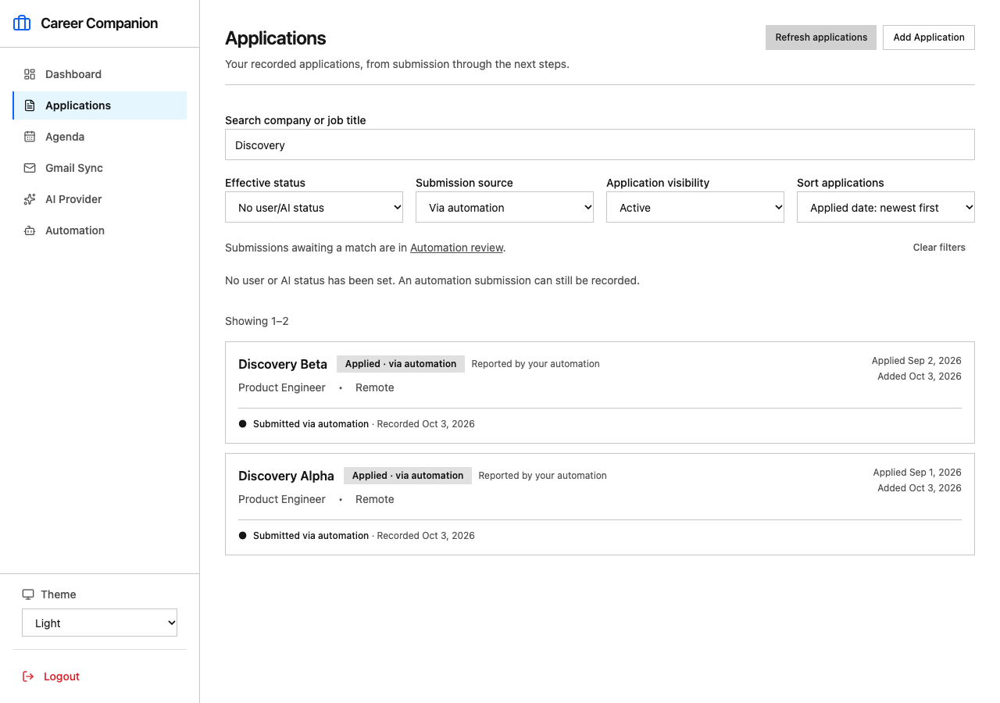
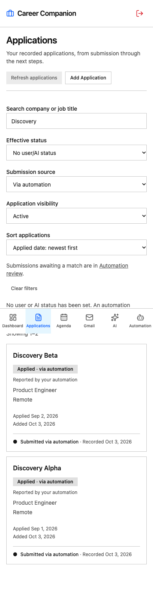

# Applications discovery completion — local execution report

Date: 2026-10-03. **AD-01, AD-02 and AD-03 implemented and verified locally.** The complete local plan and tickets were created and checked before application code changed, then implemented in that order. No migration, commit, push, PR, new checkout or external issue was performed.

## Findings and decisions

The verified scratchpad already had S9 company/title search and effective-status filtering, S11 archive visibility, and working detail/status/evidence/follow-up controls. The personal-PC summary did not describe that newer local baseline. No existing ticket was duplicated.

MCP already writes transactional application/submission evidence to PostgreSQL. Normal application reads already surface it. Missing capabilities were useful sorting, automation-source/unknown-status discovery, retained list context and clear read recovery. The existing Applications route is the right home for the entire lifecycle; a separate Applied tab would overlap an existing canonical status and split the workflow.

- **AD-01:** extended normal GET /api/applications with optional sort, submittedVia=AUTOMATION and effectiveStatus=UNKNOWN. Original filters, default createdAt/id order, response shape and pagination remain compatible. All filters/sorts run in PostgreSQL before paging; null applied dates sort last and ties end in id.
- **AD-02:** added labeled square NativeSelect controls, clear/refresh/retry, unknown-date copy, Automation review access and retained filter/sort/page state through detail visits. Canonical status still wins; separate source text preserves automation provenance after status advances. Existing Carbon-inspired tokens/primitives and detail actions remain.
- **AD-03:** proved official SDK intake → real PostgreSQL → signed-session normal API → existing application detail/evidence; expanded browser smoke to real normal-API discovery/refresh/detail-return and mobile keyboard sorting.

No new schema, index, migration, backfill, MCP tool/read surface, AI call, queue or notification behavior is needed. Source filtering uses existing owned linked/created receipts. Review-only/ignored receipts do not become application rows. Archive/retirement and manual status precedence remain unchanged.

The [API/display contract](api-contracts.md) specifies all defaults and limitations. Search state stays out of URLs/storage. Offset pagination remains a live view, not a frozen snapshot; no invented global total is displayed.

## Tickets and files

| Ticket | Local outcome |
| --- | --- |
| [AD-01](AD-01-api-discovery.md) | API capabilities, runtime schema, PostgreSQL regression coverage |
| [AD-02](AD-02-applications-experience.md) | Existing route, API client/cache, source display and UI regression coverage |
| [AD-03](AD-03-flow-verification.md) | Signed-session/SDK integration, real-stack browser checks, docs and preservation |

Incremental changes: **4 backend files and 9 frontend files**, plus this local planning/evidence pack and six existing documentation entry points. [Complete file manifest](change-manifest.md) compares against the pre-task uncommitted scratchpad, not the older Git HEAD.

Backend: application contract/service, new discovery test file and extended MCP endpoint test. Frontend: application route, client, shared contract, cache, EffectiveStatus, three test files and existing smoke runner. No navigation route or schema file changed.

## Verification

| Check | Result / evidence |
| --- | --- |
| Backend full suite | **59 files / 815 tests passed** — [output](evidence/backend-tests.txt) |
| Frontend full suite | **19 files / 215 tests passed** — [output](evidence/frontend-tests.txt) |
| Focused API regression | 5 files / 64 tests — [output](evidence/api-focused.txt) |
| Focused UI regression | 6 files / 109 tests — [output](evidence/ui-focused.txt) |
| SDK endpoint suite | 31 tests, including new signed-session discovery flow — [output](evidence/mcp-focused.txt) |
| Final Applications test file | 32 tests after test-helper typing cleanup — [output](evidence/ui-final-test.txt) |
| Builds/typechecks | Both passed — [backend](evidence/backend-build.txt), [frontend](evidence/frontend-build.txt) |
| Lint | Both passed, existing warnings — [backend](evidence/backend-lint.txt), [frontend](evidence/frontend-lint.txt) |
| Shared contracts | All 13 match; sync changed 0 files at final check — [output](evidence/contract-sync.txt) |
| Integrated browser | Passed, real local API/PostgreSQL/pg-boss/workers, synthetic external adapters and fixture authentication — [log](evidence/smoke.txt) |
| Teardown | HTTP/worker drain verified; residual users/jobs/budgets/MCP rows **0/0/0/0** |
| Preservation | Original 510 baseline files retained; unrelated hashes unchanged; schema/migrations/MCP runtime/intake and prior Sprint reports/evidence unchanged — [output](evidence/preservation.txt) |

The test and smoke lanes already had the Sprint 11 schema. This task ran **no migration commands**, even against fixtures. Tests used guarded existing career_companion_*test databases; no personal database or data was touched.

API coverage includes >20 rows, stable ties/null sorting, literal search, combined facets, contradictory manual/AI status, ownership, archive and retired effects. SDK coverage includes creation, replay, link preserving existing date/status, signed-session detail/history, foreign-session rejection, bearer rejection on normal API, archive/restore and pending resolution without duplicate applications.

Browser coverage includes arrival through the actual MCP endpoint while Applications is open, normal API refresh, applied-date ordering, unknown-status/source filters, retained context after detail, later AI status retaining source, clear controls, desktop/mobile overflow checks and keyboard type-ahead sorting. Inherited Sprint 9–11 scenarios passed in the same run.

Two browser harness adjustments were needed: the old broad “Applied” text assertion conflicted with the new “Applied date unknown” label, so it now checks the status precisely; headless Chrome on macOS ignored synthetic arrow selection even on a plain native select, so the keyboard test uses native type-ahead. Neither required weakening product behavior. Final frontend build also caught and corrected test-helper types; both final builds pass.

Existing warnings: backend unused eslint-disable directives, frontend Fast Refresh/other existing lint warnings, Vite CommonJS configuration notice, jsdom scrollTo notices and the existing large frontend bundle warning. No new dependency was introduced. The smoke harness blocks remote font loading, so screenshots validate layout/tokens with the browser fallback font; the existing IBM Plex font configuration is unchanged.

## Visual review

Desktop 1280×900 and mobile 390×844 were inspected. Square controls, readable labels, status/source/date distinction, stacking and no horizontal overflow were verified. Mobile full-page capture shows the fixed bottom navigation at the viewport boundary; the page scrolls normally.

## Preserved boundaries and deferred work

Backend HEAD remains 6af9cd2, frontend 155a1aa, docs 1e98ae4 on feat/sprint-7-8-reliability. All changes remain unstaged/uncommitted alongside the preserved Sprint 9–11 work. No Downloads checkout was inspected or modified; the existing verified scratchpad was used throughout.

Real Antigravity/automation-client acceptance remains with MCP-08/MCP-09 part B; real Gmail, owner usability, provider qualification/activation, original-data migration checks, remote CI and deployment remain separate deferred layers. These local fixture results do not claim any of those. Extraction/v3 remains as configured by the existing baseline; this task did not activate providers or alter that gate.

No unresolved local engineering defect remains from these checks. Further features such as date-range search, full-text search, analytics, saved views, bulk changes and speculative indexes are intentionally outside this requirement.
