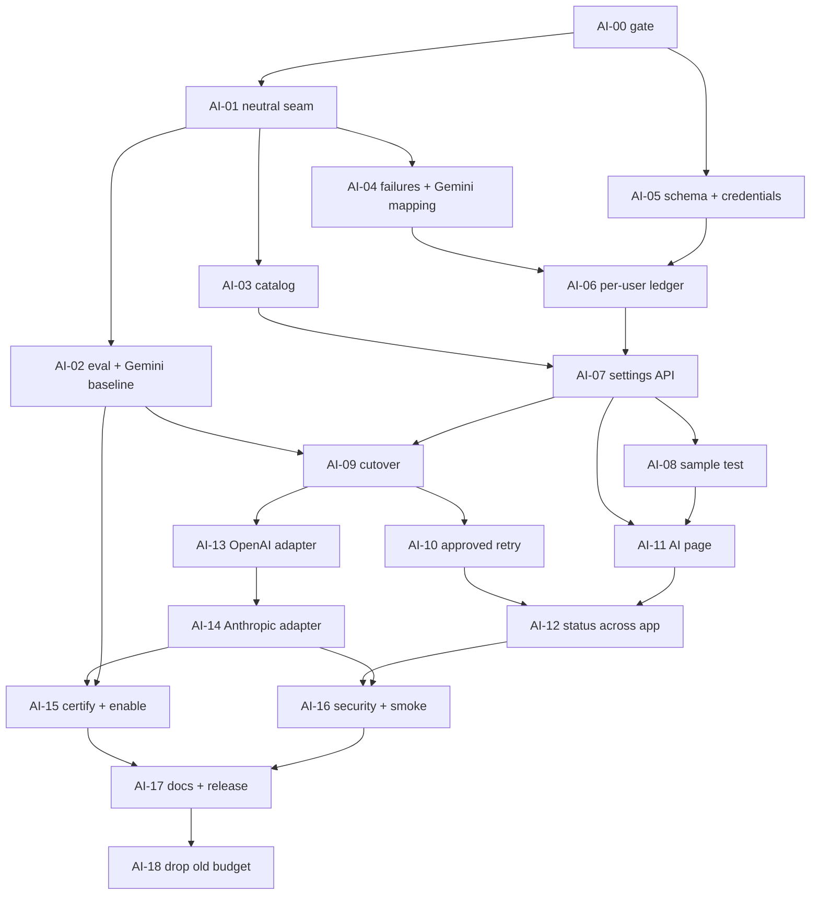

# User-provided AI (BYO AI) — implementation plan

> Office update 2026-10-03: S7-05 scheduled Gmail sync is implemented locally (00:00/18:00 Asia/Kolkata, startup catch-up), so pending work is reoffered without a manual sync once user AI access is ready. This does not certify any provider; AI-15 live evidence/disclosure approval remains pending.

| Field | Value |
| --- | --- |
| Status | **Implemented locally 2026-10-02 (AI-00 to AI-14, AI-16); not released.** Live certification (AI-15) and the release run (AI-17) wait for real provider keys and the owner's data-use approval; AI-18 follows one stable release. See the [execution report](execution-report.md). |
| Architecture source of truth | [ADR-0001](../../architecture/decisions/ADR-0001-user-provided-ai.md) (accepted 2026-10-02) and [AI capability architecture](../../architecture/ai-capability-architecture.md) |
| Baseline inspected | Backend `src/services/ai/*`, `src/jobs/emailProcessingJob.ts`, `src/services/gmailSync.ts`, `src/routes/email.ts`, `prisma/schema.prisma`, test suite and smoke harness; frontend routes, API client, contracts sync, tests. Downloaded working copies, 2026-10-02 (no `.git` present). |
| Issue breakdown | [issues.md](issues.md) — AI-00 to AI-18, local IDs. No Linear identity is assumed. |
| Entry gate | Sprint 6 committed · S6-R06 complete · real git repositories identified (AI-00). Nothing here starts before that. |

This plan turns the accepted architecture into engineering work. Where the architecture left a choice to implementation, this plan makes it and says why (§14). It does not reopen accepted decisions.

---

## 1. Executive summary

**What gets built**

- The Gemini-only, env-key AI layer becomes a provider-neutral layer with three protocol adapters: Gemini, OpenAI-compatible and Anthropic.
- Prompts and Zod schemas move out of `GeminiProvider` into Career Companion-owned contract definitions. Text and versions stay the same.
- Each user stores one AI configuration: provider, encrypted key, optional model choices, access state, consent.
- The global daily budget and global cooldown become a per-user safety limit, per-user usage counts and a per-user cooldown.
- Missing or refused AI access leaves emails `PENDING`. The job is acknowledged and no retry is used.
- Held operations (unknown outcome, invalid output) can be retried once per explicit user approval.
- A new **AI provider** page lets the user choose a provider, paste a key, pick models, see status, run a sample test, switch or remove.
- A small synthetic evaluation set and a manual runner decide which provider/model pairs are supported.

**Shape of the change**

- **2 new tables:** `ai_configurations` and `ai_usage_days`. 3 new columns on `ai_operations`. No other schema change.
- **5 new operations on one resource**, `/api/ai/settings` (read, save, check, sample test, remove). One existing endpoint (`POST /api/emails/:id/retry`) gains an approval flag.
- **1 new page** (`/ai`), plus notices on the dashboard and Gmail page, a "Retry anyway" dialog and provenance labels.
- **No new infrastructure:** no scheduler, no catalog database, no separate service, no new queue.

**Order**

1. Behavior-preserving seam.
2. Catalog, errors, data.
3. Per-user ledger and settings API.
4. Cutover to user keys.
5. Frontend.
6. OpenAI and Claude adapters, then certification.
7. Verification and release.

Gemini can ship alone. OpenAI and Claude ship only after they pass evaluation.

**Two product decisions remain** (§15): ordering against the MCP feature (ADR-0002), and who signs off provider data-use text. Ordering is settled: BYO AI was implemented first, on 2026-10-02.

---

## 2. Current → target implementation map

| Area | Current | Target | Changes / stays | Why | Blocking? |
| --- | --- | --- | --- | --- | --- |
| Provider integration | `GeminiProvider.getInstance()` singleton, key from `GEMINI_API_KEY`, models from env | `createProviderClient(provider, apiKey)` per job, one adapter module per protocol | **Changes.** Gemini code becomes the Gemini adapter. Hardening (retries off, timeout, token limit, thinking off) stays. | Several providers; keys are per user | Blocking (first) |
| Prompts and schemas | Prompts and a hand-written Gemini schema live in `GeminiProvider.ts`; Zod in `contracts.ts` | `AI_CONTRACTS` in `services/ai/contracts.ts`: version, prompt, Zod schema, role, input and output bounds. Each provider's schema is derived from Zod. | **Changes location only.** Prompt text and `classification/v2` / `extraction/v2` unchanged. | One contract version must mean one prompt and schema for every provider | Blocking (first) |
| Feature interfaces | `RelevanceClassifier`, `EmailAnalyzer` | Same interfaces, now also returning model and token usage | **Stays** (small extension) | Business code must not learn about providers | — |
| Credentials | One server env key | Per-user AES-256-GCM ciphertext with a dedicated key, bound to the user ID | **New** | The key is the user's billing secret | Blocking |
| Model configuration | `GEMINI_RELEVANCE_MODEL`, `GEMINI_EXTRACTION_MODEL` | Code catalog in `src/contracts/aiCatalog.ts`, synced to the frontend; per-user optional override | **New**; env vars removed at cutover | Curated, tested models only | Blocking for settings |
| Operation ledger (`runOperation`) | Claim → global budget and cooldown → call → checkpoint. 429/503 use up to 3 attempts. | Claim → per-user cooldown and limit → call → checkpoint. Refusals release the claim and restore the attempt. The ledger records provider and model. Approved retries. | **Changes.** Claim-before-call, reuse, held states and no auto-replay all stay. | Per-user isolation; refusal rule; approved retry | Blocking |
| Daily limit | `ai_call_budgets` keyed by day, global | `ai_usage_days` keyed by user and day: calls, input and output tokens, verifications | **Replaced**; the old table is dropped after release | Per-user safety limit and counts | Blocking |
| Worker and job errors | Budget/cooldown → `RetryableAIError` → pg-boss retry → `FAILED` after 3. Unknown outcome is rethrown. | No access → email back to `PENDING`, job acknowledged. Unknown outcome → `FAILED` at once (held). | **Changes.** Batch size 1, completed-never-downgraded and sanitized storage stay. | ADR decisions 8 and 9 | Blocking; needs S6-R06 |
| Gmail sync and ingestion | Ingest enqueues new emails; after a scan, re-offers 100 oldest `PENDING` | Re-offer extracted to `reofferPendingEmails(userId)`, newest first, skipped when AI is not ready. Called from sync and after a settings fix. | **Mostly stays** | Resume after a fix without a scheduler | Independent |
| Email retry API | Held operations → 409 `AI_OPERATION_REQUIRES_REVIEW` | Approvable holds → 409 `AI_RETRY_NEEDS_APPROVAL`; resend with `acceptPossibleDuplicateCharge: true` | **Extended** | ADR decision 10 | After ledger |
| Matching, applications, actions, notifications | — | — | **Unchanged** | Out of scope | — |
| Auth | Session, `requireAuth`, dev header outside production | Same | **Unchanged** | — | — |
| Frontend | No AI UI. Raw processing state in the Gmail table. | `/ai` page, AI notice on dashboard and Gmail page, "Waiting for AI" label, "Retry anyway" dialog, provenance labels | **New** | Users set up and fix their own AI | After API |
| Tests and smoke | Tests and smoke patch `GeminiProvider.getInstance` | Tests mock `createProviderClient` / use a fake client; smoke installs a fake client and creates sealed fixture configurations | **Changes** in AI-01 | The singleton disappears | Blocking (first) |
| Config and secrets | `GEMINI_*`, `AI_DAILY_CALL_LIMIT` (global) | `AI_CREDENTIAL_ENCRYPTION_KEY`, `AI_USER_DAILY_CALL_LIMIT` (per user). `GEMINI_*` rejected in production. | **Changes** | No hosted key exists after cutover | At cutover |
| Evaluation | None | `backend/eval/ai/`: synthetic dataset, scorer, manual runner, committed reports | **New** | Evaluation gate | Independent after seam |

---

## 3. Backend implementation plan

### 3.1 Module layout

```
backend/src/contracts/
  aiCatalog.ts          NEW  providers, models, roles, recommended defaults, disclosures (synced to frontend)
  ai.ts                 NEW  zod request/response schemas for /api/ai/* and the retry approval
backend/src/services/ai/
  contracts.ts          CHANGED  AI_CONTRACTS (prompt, schema, role, bounds); existing schemas and versions unchanged
  errors.ts             CHANGED  + AIAccessError(reason, resumesAt?), + AIOutcomeUnknownError
  providers/
    types.ts            NEW  ProviderClient, StructuredRequest/Response, VerifyResult, ProviderFailure
    jsonSchema.ts       NEW  Zod → JSON Schema per dialect; null→absent normalization for optional keys
    gemini.ts           NEW  from GeminiProvider.ts (+ classifyGeminiError)
    openai.ts           NEW  (AI-13) OpenAI-compatible; baseURL from catalog only
    anthropic.ts        NEW  (AI-14)
    index.ts            NEW  createProviderClient(provider, apiKey): switch on protocol — the single test seam
  capabilities.ts       NEW  bindCapabilities(client, provider, models) → classifier, analyzer, provenance
  credentials.ts        NEW  sealApiKey(userId, key) / openApiKey(userId, sealed)
  access.ts             NEW  getAccessState(userId) (no decryption) and resolveAIAccess(userId) (decrypts)
  usage.ts              NEW  reserveUserCall(tx, userId, now), recordTokens(), access-state writes guarded by revision
  operations.ts         CHANGED  per-user limit/cooldown, refusal release, outcome kinds, approved retries, provenance
  pipeline.ts           CHANGED  lazy access resolution; provenance from the ledger
  settings.ts           NEW  read status, save (verify then store), check again, sample test, remove
  sampleEmail.ts        NEW  one built-in synthetic recruiter email (also evaluation case 1)
  gemini/GeminiProvider.ts  DELETED in AI-01
backend/src/routes/ai.ts           NEW   /api/ai/settings
backend/src/routes/email.ts        CHANGED  retry approval
backend/src/jobs/emailProcessingJob.ts  CHANGED  access waits; unknown outcome final
backend/src/services/gmailSync.ts  CHANGED  extract reofferPendingEmails(userId)
backend/src/utils/gmailTokenEncryption.ts  CHANGED  encrypt/decrypt accept optional AAD (existing calls unchanged)
backend/src/utils/config.ts        CHANGED  production checks for AI secrets and removed variables
backend/eval/ai/                   NEW  dataset/, score.ts, run.ts, reports/
```

There is no generic plugin registry, no provider class hierarchy and no DI container. `createProviderClient` is one `switch` over three protocols.

### 3.2 Provider-neutral contracts

```ts
// services/ai/contracts.ts (shape, not final code)
export const AI_CONTRACTS = {
  classification: {
    version: 'classification/v2', role: 'fast', schemaName: 'email_relevance',
    instructions: /* today's prompt, byte-identical */, schema: EmailRelevanceSchema,
    input: { sender: 512, subject: 1000, labels: 30, snippet: 1000 }, maxOutputTokens: 2048,
  },
  extraction: {
    version: 'extraction/v2', role: 'detailed', schemaName: 'job_extraction',
    instructions: /* today's prompt, byte-identical */, schema: JobExtractionSchema,
    input: { body: 8000 }, maxOutputTokens: 2048,
  },
} as const;
```

- Input bounds move from literals in `pipeline.ts` to the contract. The values do not change.
- **Contract fingerprint test:** a fixture stores a SHA-256 of `instructions + derived JSON Schema` for each version. Changing either without a new version fails the test. This is what "a version always means the same instructions and schema" requires.
- Each adapter derives its schema with Zod 4's `z.toJSONSchema()` and then applies its dialect rules: required keys, nullable unions, `additionalProperties: false`, and removal of unsupported keywords. The hand-written Gemini schema is deleted after a test proves the derived Gemini schema is equivalent to it (AI-01).
- The `category` key is `.optional()` in Zod. Strict dialects (OpenAI) must list every key as required, so they send `category` as nullable. The adapter turns `null` back into "absent" for keys that are optional in Zod before validation. The schema and version do not change.

### 3.3 Provider client interface

```ts
type FailureKind =
  | 'KEY_REJECTED' | 'ACCOUNT_OR_BILLING' | 'MODEL_UNAVAILABLE'   // needs attention
  | 'RATE_LIMITED'                                               // limited (provider refusal)
  | 'OUTCOME_UNKNOWN'                                            // held
  | 'INVALID_OUTPUT'                                             // held, approvable
  | 'INVALID_REQUEST';                                           // failed, engineering fix

class ProviderFailure extends Error {          // fixed message per kind; never provider text
  kind: FailureKind; status?: number; providerCode?: string /* allowlisted token */; retryAfterMs?: number;
}

interface StructuredRequest {
  model: CatalogModel; instructions: string; input: string;
  jsonSchema: object; schemaName: string; maxOutputTokens: number;
}
interface StructuredResponse { data: unknown; usage: { inputTokens: number | null; outputTokens: number | null } }

type VerifyResult =
  | { result: 'VERIFIED' }
  | { result: 'REJECTED'; kind: 'KEY_REJECTED' | 'ACCOUNT_OR_BILLING' | 'MODEL_UNAVAILABLE'; modelId?: string }
  | { result: 'INCONCLUSIVE' };

interface ProviderClient {
  generateStructured(req: StructuredRequest): Promise<StructuredResponse>; // throws ProviderFailure only
  verifyModels(modelIds: string[]): Promise<VerifyResult>;                  // never throws
}
function createProviderClient(provider: CatalogProvider, apiKey: string): ProviderClient;
```

**Every adapter must:**
- set SDK retries to 0;
- use the catalog model's `timeoutMs`;
- send the contract's output-token limit under that protocol's parameter name;
- use the catalog's temperature and reasoning settings;
- call only the catalog's fixed base URL;
- turn every SDK error into a `ProviderFailure` built only from status code, an allowlisted provider error code and `retry-after`.

**Adapters must never:**
- attach the original SDK error as `cause`;
- copy provider message text into an error.

Some SDKs echo a masked key or input in their messages.

**Capability binding (`capabilities.ts`).** `bindCapabilities` returns objects that implement `RelevanceClassifier` and `EmailAnalyzer`. Each method:
1. builds the request from the contract;
2. calls `generateStructured`;
3. normalizes dialect nulls;
4. validates with the contract's Zod schema (`safeParse`; failure → `ProviderFailure('INVALID_OUTPUT')`);
5. returns `{ version, data, model, usage }`.

### 3.4 SDKs and per-protocol details

**Decision:** official vendor SDKs behind the interface, with exact pinned versions: `@google/genai` (already installed), `openai`, `@anthropic-ai/sdk`. All three:
- allow retries 0 and explicit timeouts;
- expose status and error codes;
- report token usage;
- offer a model lookup for verification.

A multi-provider SDK would hide provider error codes behind its own error type. We would still need direct calls for verification. See §14.

| Protocol | Structured output | Token parameter | Reasoning control | Verify call | Notes |
| --- | --- | --- | --- | --- | --- |
| Gemini | Response schema from Zod (JSON Schema or OpenAPI subset, whichever the installed SDK supports for the catalog models) | `maxOutputTokens` | `thinkingConfig` from the catalog (today `thinkingBudget: 0`) | `models.get` per model | Existing `httpOptions.retryOptions.attempts: 1` |
| OpenAI-compatible | `response_format: json_schema, strict: true` | `max_completion_tokens` | `reasoning_effort` from the catalog where the model supports it; omit temperature when unsupported | `models.retrieve` per model | `finish_reason: 'length'` or a `refusal` → `INVALID_OUTPUT`. `baseURL` comes from the catalog entry, never from user input. |
| Anthropic | Native JSON-schema output where the catalog says the model supports it, otherwise a forced tool call with `input_schema` | `max_tokens` | Thinking off | `models.retrieve` per model | `stop_reason` `max_tokens` or `refusal` → `INVALID_OUTPUT` |

### 3.5 Catalog (code, synced to frontend)

`backend/src/contracts/aiCatalog.ts` is plain data plus types. It is copied to the frontend by the existing `npm run sync-contracts`, so there is no catalog endpoint.

```ts
type AIRole = 'fast' | 'detailed';
interface CatalogModel {
  id: string; displayName: string; roles: AIRole[]; recommendedFor: AIRole[];
  structuredOutput: 'gemini_schema' | 'openai_json_schema' | 'anthropic_native' | 'anthropic_tool';
  temperature: number | null;                 // null = not supported, omit
  reasoning: { param: string; value: string | number } | null;
  timeoutMs: number; retiresOn: string | null;  // YYYY-MM-DD
  evaluation: { date: string; report: string } | null;   // required when the provider is supported
}
interface CatalogProvider {
  id: 'gemini' | 'openai' | 'anthropic';      // stored as text; matches existing provenance 'gemini'
  displayName: string; protocol: 'gemini' | 'openai' | 'anthropic'; baseUrl: string;
  status: 'supported' | 'hidden';             // hidden = code merged, not offered, rejected by the API
  costModel: 'FREE_TIER_AVAILABLE' | 'PAID_ONLY'; recommendedNote: string;
  links: { apiKeys: string; billing: string; dataUse: string };
  setupSteps: string[];
  disclosure: { version: string; summary: string; training: string; residency: string; reviewedOn: string };
  models: CatalogModel[];
}
```

**Rules**
- Exactly one recommended model per role per supported provider.
- Model IDs are never user strings. The API accepts only catalog IDs for that provider and role.
- **Retirement:** a configured model that is missing from the catalog, or past `retiresOn`, resolves to the provider's recommended model for that role. The status response flags it (`source: 'REPLACED_RETIRED'`). No data migration is needed.
- **Gemini models:** today's `gemini-2.5-flash-lite` (fast) and `gemini-2.5-flash` (detailed) are the baseline entries.
- **OpenAI and Claude models:** picked during certification (AI-15) from each provider's current small and mid models with reliable structured output. The plan does not fix them now, because model churn would make that stale.

### 3.6 Failure normalization and provider mapping

Career Companion's vocabulary is the `FailureKind` list (§3.3). Each adapter exports `classify<Provider>Error(err): ProviderFailure` and has a table-driven test.

**Starting tables.** Each must be confirmed with a real key before that provider is supported (O2):

| Kind | Gemini | OpenAI | Anthropic |
| --- | --- | --- | --- |
| `KEY_REJECTED` | 400 `INVALID_ARGUMENT` with reason `API_KEY_INVALID`; 401 | 401 | 401 `authentication_error` |
| `ACCOUNT_OR_BILLING` | 403 `PERMISSION_DENIED`; 400 `FAILED_PRECONDITION` (region, billing) | 403; 429 with code `insufficient_quota` | 403 `permission_error`; billing or credit errors (confirm the status and type with a real zero-credit key) |
| `MODEL_UNAVAILABLE` | 404 for the model | 404 `model_not_found` | 404 `not_found_error` |
| `RATE_LIMITED` | 429 `RESOURCE_EXHAUSTED`; 503 `UNAVAILABLE` | 429 (other codes); 503 | 429 `rate_limit_error`; 529 `overloaded_error` |
| `OUTCOME_UNKNOWN` | timeout, network, 500, 504, anything unrecognized | same | same, plus 500 `api_error` |
| `INVALID_OUTPUT` | empty text, non-JSON, schema-invalid | `finish_reason: length`, refusal, non-JSON, schema-invalid | `stop_reason: max_tokens` or `refusal`, missing tool input, schema-invalid |
| `INVALID_REQUEST` | other 400 | other 400 | other 400 / 413 |

**Unrecognized responses map to `OUTCOME_UNKNOWN`.** That is the conservative default: held, never replayed.

### 3.7 Access resolution

```ts
type AccessReason = 'NOT_SET_UP' | 'KEY_REJECTED' | 'ACCOUNT_OR_BILLING' | 'MODEL_UNAVAILABLE'
  | 'PROVIDER_UNSUPPORTED' | 'KEY_UNREADABLE' | 'RATE_LIMITED' | 'PROVIDER_UNAVAILABLE'
  | 'SAFETY_LIMIT' | 'PAUSED';
type AccessState = 'NOT_SET_UP' | 'READY' | 'NEEDS_ATTENTION' | 'LIMITED';
```

**`getAccessState(userId, now)`** reads the configuration and today's usage, with no decryption. It is used by the status API and by the re-offer check. It checks in this order:

1. `AI_USER_DAILY_CALL_LIMIT = 0` → LIMITED / `PAUSED` (operator kill switch).
2. No configuration → NOT_SET_UP.
3. Provider missing from the catalog or not `supported` → NEEDS_ATTENTION / `PROVIDER_UNSUPPORTED`.
4. `accessIssue` ∈ {KEY_REJECTED, ACCOUNT_OR_BILLING, MODEL_UNAVAILABLE} → NEEDS_ATTENTION.
5. `cooldownUntil > now` → LIMITED / `accessIssue` (`RATE_LIMITED` or `PROVIDER_UNAVAILABLE`), with `resumesAt = cooldownUntil`.
6. `calls ≥ limit` today → LIMITED / `SAFETY_LIMIT`, with `resumesAt` = next 00:00 UTC.
7. Otherwise → READY.

**`resolveAIAccess(userId)`** does the same and then:
- decrypts the key (failure → NEEDS_ATTENTION / `KEY_UNREADABLE`, logged at error level without values);
- resolves the models (retired fallback);
- returns `{ ready: true, provider, models, revision, capabilities }`.

**Where it runs.** In `EmailAIPipeline.processEmail`, lazily and at most once per job. That is after completed-result adoption and the deterministic label filter, and before the first `runOperation`. So promotions still finish without AI, and reused results need no key.
- Unavailable → `throw new AIAccessError(reason, resumesAt)`.
- Classification and extraction in one job use the same resolved access.

### 3.8 Operation boundary (`runOperation`) after the change

Signature: `runOperation({ userId, emailId, contract, access, invoke })` returns `{ data, provider, model }`.

1. **Ownership check, `createMany` and read:** unchanged.
2. **`COMPLETED`** → reuse. Provenance comes from the row's `provider`/`model`. Rows from before the migration are backfilled to `gemini`, model unknown.
3. **Held** → `TerminalAIError('AI operation requires review')`, as today. Held means:
   - `status ∈ {PROCESSING, UNKNOWN, FAILED}`, or
   - `attempts ≥ MAX_ATTEMPTS + approvedRetries`.
4. **Claim transaction:**
   - `updateMany where { id, status ∈ {PENDING, RETRYABLE}, attempts: existing.attempts, retryAfter null|≤now }`. This is a compare-and-set on `attempts`, which replaces `attempts < MAX_ATTEMPTS` in SQL; the bound is checked in step 3. It sets `PROCESSING`, `attempts+1`, `startedAt`, `provider`, `model`.
   - Then `reserveUserCall(tx, userId, now)`:
     - configuration cooldown active → `AIAccessError`;
     - limit 0 → `PAUSED`;
     - otherwise upsert `ai_usage_days(userId, day)` and `updateMany … calls < limit → calls+1`. No row → `AIAccessError('SAFETY_LIMIT')`.
   - Any throw rolls back the claim, as today.
5. **Call `invoke()`**, then record tokens on the usage row: best effort, after any response that has usage.
6. **Outcome by kind** (one transaction per outcome):

| Outcome | Operation row | User configuration (guarded by `revision`) | Thrown |
| --- | --- | --- | --- |
| Success | `COMPLETED`, result, `completedAt` | Clear `RATE_LIMITED`/`PROVIDER_UNAVAILABLE` issue, cooldown and `consecutiveFailures` if set | — |
| `KEY_REJECTED` / `ACCOUNT_OR_BILLING` / `MODEL_UNAVAILABLE` | Back to the previous status, `attempts−1`, `errorCode = kind` | `accessIssue = kind` (+ `accessIssueModel`) | `AIAccessError(kind)` |
| `RATE_LIMITED` | Same release | Cooldown = provider `retry-after` (bounded 10 s–1 h), else 60 s × 2^(n−1), capped at 30 min; `consecutiveFailures+1` | `AIAccessError('RATE_LIMITED', resumesAt)` |
| `OUTCOME_UNKNOWN` (or any unclassified throw) | `UNKNOWN`, `errorCode` | Cooldown 2 min × 2^(n−1), capped at 30 min, `accessIssue = PROVIDER_UNAVAILABLE` | `AIOutcomeUnknownError` (terminal) |
| `INVALID_OUTPUT` | `FAILED`, `errorCode = INVALID_OUTPUT` | — | `SchemaValidationFailure` (terminal) |
| `INVALID_REQUEST` | `FAILED`, `errorCode = INVALID_REQUEST` | — | `TerminalAIError` |

7. **Checkpoint write stays outside the catch.** A persistence failure leaves `PROCESSING`, as today.

**Why a cooldown after an unknown outcome:** without it, a provider outage turns every email processed during the outage into a held operation that needs the user's approval and may double-charge. With it, an outage costs at most one held operation per user per cooldown window. Other emails wait as `PENDING`. Nothing is replayed.

**Revision guard:** every write to the configuration from a job uses `updateMany where { userId, revision: access.revision }`. A job that resolved the old key cannot mark a newly saved key as rejected.

### 3.9 Safety limit, usage counts and cooldown

- **`AI_USER_DAILY_CALL_LIMIT`:** default **500**, bounds 0–5000, per user per UTC day.
  - It counts every call sent: real processing, retries and sample tests.
  - 0 pauses all AI calls (kill switch).
  - It is not user-adjustable in V1.
  - **Why 500:** an email costs 1 call (irrelevant) or 2 (relevant/uncertain), so 500 covers a heavy job-search day plus backlog. A defect cannot exceed 500 calls per user per day.
  - The value is confirmed in the supervised release run (AI-17).
- **Old variable:** `AI_DAILY_CALL_LIMIT` (global meaning) is rejected at production startup with a "renamed, now per user" message. A silent change of meaning would be worse.
- **Usage:** calls, input tokens and output tokens per user per day. Shown to the user as Career Companion's own counts, not provider billing. No currency estimates.
- **Cooldown:** per user, on the configuration row, so it survives the UTC day boundary. It grows with `consecutiveFailures` and resets on the first success.
- **Verification cap:** 20 content-free verifications per user per day (`ai_usage_days.verifications`). It stops the server being used as a validity oracle for stolen keys. It is a code constant.

### 3.10 Worker behavior (`emailProcessingJob.ts`)

Built on S6-R06: the worker throws only a sanitized error to pg-boss.

- **`AIAccessError`:**
  - `updateMany where not COMPLETED → processingState: 'PENDING'` and clear the five error fields (the reason lives on the configuration);
  - log `job_waiting_for_ai { jobId, emailId, reason }`;
  - return. The job is acknowledged; no queue retry or operation attempt is used.
- **`AIOutcomeUnknownError`** (subclass of `TerminalAIError`) → `FAILED`, `processingRetryable: false`, category `OutcomeUnknown`, acknowledged. No pointless queue retry against a held operation.
- **`SchemaValidationFailure` / `TerminalAIError`:** unchanged (`FAILED`, acknowledged).
- **Other errors** (Gmail transport, database): unchanged. Sanitized, queue retry, `FAILED` at the final attempt.
- **Job payload stays `{ userId, emailId }`.** A test asserts the exact key set.

### 3.11 Resuming waiting work (no scheduler)

The accepted architecture says "no new scheduler". The 2026-10-01 product decision also limits scheduled processing to the twice-daily Gmail sync. So resumption reuses existing triggers.

- **`reofferPendingEmails(userId, limit = 100)`** is extracted from `GmailSyncService.syncUser`'s recovery loop.
  - Order changes to **newest first** (`receivedAt desc nulls last, id desc`), so a fresh interview email is not stuck behind a backlog.
  - It returns without enqueuing when `getAccessState` is not READY, so no-op jobs and Gmail metadata calls are avoided. Ingest-time enqueue of new emails is unchanged, so deterministic promotions still finish.
- **Called from:**
  - the end of every sync (manual today; the twice-daily scheduled sync when it is built);
  - after a successful save;
  - after a successful "Check again".
- **After a cooldown or the daily limit clears**, processing continues on the next sync. The UI says so honestly ("Paused until about 14:05 — sync after that to continue") and offers the existing Sync action.

### 3.12 Verification (save and "Check again")

- `verifyModels([fast, detailed])` uses the provider's model lookup. It is content-free, uses no tokens, writes no ledger row and does not count toward the safety limit.
- It counts toward the verification cap. Timeout is 10 s.
- **Result handling:**
  - `REJECTED` → nothing saved on save; on check, sets `accessIssue`.
  - `INCONCLUSIVE` → save stores the configuration with `verifiedAt = null`; check only updates `lastCheckedAt` and never overwrites a known state.
  - `VERIFIED` → sets `verifiedAt` and clears needs-attention issues. A rate-limit cooldown stays, because a model lookup does not prove the limit has cleared.

### 3.13 Sample test

- Uses the **stored** configuration only. No key is accepted on this endpoint.
- Runs both contracts on `sampleEmail.ts` through `bindCapabilities`. Each call is reserved with `reserveUserCall`, so it counts toward the limit and usage.
- No ledger row, nothing persisted. Returns the validated objects.
- Access refusals update the configuration exactly like real calls, so a sample test that finds missing billing shows Needs attention.

### 3.14 User-approved retry

- **Ledger:** `approvedRetries Int @default(0)` on `ai_operations`.
- **Approvable holds:**
  - `UNKNOWN`;
  - `FAILED` with `errorCode ∈ {INVALID_OUTPUT, SchemaValidationFailure, AIProviderError}` (the last two cover legacy rows);
  - `PROCESSING` with `startedAt` older than 15 minutes (a crash after the call);
  - `PENDING`/`RETRYABLE` with exhausted attempts (legacy 429 rows).
- **Not approvable:** `INVALID_REQUEST`, legacy `TerminalAIError` rows, and legacy partial results without a ledger. These stay operator-only, as today.
- **Approval** (one transaction, compare-and-set on the observed status and attempts): `status → RETRYABLE`, `retryAfter → null`, `approvedRetries + 1`; log `ai_retry_approved { userId, emailId, operation, version, previousStatus, provider }`; enqueue the email.
- **Exactly one more call per approval:** `attempts < MAX_ATTEMPTS + approvedRetries`. If that call ends unknown or invalid again, a new approval is needed.
- **Access must be READY to approve.** Otherwise 409 `AI_ACCESS_UNAVAILABLE`, so the user never approves a charge that would sit and wait.
- **The dialog names both providers:** where the earlier attempt went (from the operation's `provider`/`model`) and which provider will be used now. A retry after a switch is the user's explicit choice to send to the new provider (ADR decision 11).

### 3.15 Logging and observability

- **Format:** structured JSON `console.*`, as today.
- **Allowed fields:** IDs (`userId`, `emailId`, `jobId`, operation ID), operation, version, attempt, provider ID, model ID, failure kind, HTTP status, allowlisted provider code, token counts, duration, outcome.
- **New events:** `ai_settings_saved` (provider, verification), `ai_settings_removed`, `ai_access_checked` (result, kind), `ai_access_refused` (kind, cooldown seconds), `ai_sample_test` (outcome, tokens), `ai_retry_approved`, `job_waiting_for_ai` (reason), `ai_credential_unreadable`.
- **`ai_usage`** gains `provider`, `userId` and `outcome`.
- **Never logged:** keys or any part of a key, prompts, inputs, raw responses, provider messages, email content.
- No metrics system, dashboard or log store is added.

### 3.16 Configuration

| Variable | Change |
| --- | --- |
| `AI_CREDENTIAL_ENCRYPTION_KEY` | **New.** 64 hex characters. Required in production, and must differ from `GMAIL_TOKEN_ENCRYPTION_KEY` (startup check). Back it up: losing it makes every stored AI key unreadable (users see "Enter your API key again"). |
| `AI_USER_DAILY_CALL_LIMIT` | **New** (replaces `AI_DAILY_CALL_LIMIT`). Default 500, 0–5000, 0 = pause all AI. |
| `AI_DAILY_CALL_LIMIT` | **Removed.** Rejected at production startup. |
| `GEMINI_API_KEY`, `GEMINI_RELEVANCE_MODEL`, `GEMINI_EXTRACTION_MODEL` | **Removed at cutover.** `GEMINI_API_KEY` rejected at production startup, so no hosted key can come back by accident. |
| `RELEVANCE_CONFIDENCE_THRESHOLD` | Unchanged. |
| `AI_EVAL_API_KEY` | Evaluation runner only. Shell environment, never in an `.env` file. |

---

## 4. Database plan

**One additive migration** (AI-05), plus one data backfill, plus one cleanup migration after release (AI-18). It runs through `scripts/guarded-migrate.cjs`, with fresh and upgrade lanes checked by `scripts/verify-migration-preservation.cjs`.

### 4.1 `ai_configurations` (new): one active setup per user

| Column | Type | Why |
| --- | --- | --- |
| `userId` | uuid **PK**, FK `users` `ON DELETE CASCADE` | One configuration per user is a key constraint, not code. Deleting the user deletes the secret. |
| `provider` | text not null, `CHECK (provider <> '')` | Catalog ID. Text, not an enum: adding a provider is catalog work, not a migration. Validated against the catalog at the API and at resolution. |
| `encryptedApiKey` | text not null | `v1:<iv>:<ciphertext+tag>` (base64). Only ciphertext is stored. |
| `fastModel`, `detailedModel` | text null | `null` = follow the recommended model, so users on recommended move with the catalog. A value = an Advanced choice. |
| `accessIssue` | enum `AIAccessIssue` null: `KEY_REJECTED`, `ACCOUNT_OR_BILLING`, `MODEL_UNAVAILABLE`, `RATE_LIMITED`, `PROVIDER_UNAVAILABLE` | Needs-attention cause or limited cause. Career Companion's own closed vocabulary, so an enum. The reason is stored once here, not on every email. |
| `accessIssueModel` | text null | Which model a `MODEL_UNAVAILABLE` refers to, so the fix is "choose another fast model". A catalog ID, never provider text. |
| `verifiedAt` | timestamptz null | Last definitive verification success. `null` = saved while inconclusive. |
| `lastCheckedAt` | timestamptz null | "Last checked" on the status card. |
| `cooldownUntil` | timestamptz null | Per-user provider cooldown. Survives day boundaries. |
| `consecutiveFailures` | int not null default 0, `CHECK >= 0` | Cooldown growth. Reset on success. |
| `consentDisclosure` | text not null | Catalog disclosure version the user agreed to (for example `openai-2026-10`). Records what text they saw. |
| `consentedAt` | timestamptz not null | When. Consent is per provider because the row has one provider and switching re-consents. |
| `revision` | int not null default 0 | Incremented on every save. Guards job-side state writes (§3.8). |
| `createdAt`, `updatedAt` | timestamptz | Convention. |

Not stored: key hint or last four, provider display data, model capabilities (catalog), usage, any provider text.

### 4.2 `ai_usage_days` (new): replaces `ai_call_budgets`

| Column | Type | Why |
| --- | --- | --- |
| `userId` | uuid, FK `users` cascade | Per-user isolation |
| `day` | text `YYYY-MM-DD` (UTC) | Same format as the existing budget, so the claim code changes little |
| `calls` | int default 0 | Safety limit counter (every call sent) |
| `inputTokens`, `outputTokens` | int default 0 | Career Companion's own counts for the status card and diagnostics |
| `verifications` | int default 0 | Verification cap |
| PK | (`userId`, `day`) | Atomic upsert and conditional increment |
| CHECKs | all counters ≥ 0 | Integrity |

Rows are tiny: at most one per user per active day. **No pruning job in V1** (§14).

### 4.3 `ai_operations` (changed)

| Column | Why |
| --- | --- |
| `provider` text null, `model` text null | Set at claim time. Gives correct provenance when a completed operation is reused after a provider switch, and tells the user where an uncertain charge happened. Metadata only (ADR decision 12). |
| `approvedRetries` int not null default 0, `CHECK >= 0` | Records each user approval. Bounds approved attempts. |
| **Backfill:** `UPDATE ai_operations SET provider = 'gemini' WHERE attempts > 0` | Only Gemini has ever run. Model stays `null` ("model not recorded"). |

### 4.4 Reused unchanged

- `emails`: waiting is `PENDING`; the error fields are cleared on waiting.
- `ai_processing_results`: `provider`/`model` now come from the ledger.
- `users`, `sessions`.
- No ownership triggers are needed: every new row is keyed by `userId` directly, and operations stay owned through `emails`.

**Indexes:** primary keys only. The waiting count uses the existing `emails(userId)` index; per-user volumes are small.

### 4.5 Cleanup (AI-18, after one stable release)

`DROP TABLE ai_call_budgets`. It is kept until then so the release can be inspected and compared.

---

## 5. API plan

All routes:
- live in `backend/src/routes/ai.ts`, mounted at `/api/ai`;
- use `requireAuth` (session; dev header only outside production);
- use JSON;
- use zod contracts in `src/contracts/ai.ts` (strict objects, unknown keys rejected);
- use the error envelope `{ error: { code, message, details? } }`.

The user always comes from the session, and no route takes a user ID or configuration ID.

**Shared response: `AISettingsResponse`**

```ts
{
  configured: boolean,
  provider: 'gemini' | 'openai' | 'anthropic' | null,
  models: { fast: ModelInUse, detailed: ModelInUse } | null,   // ModelInUse = { id, source: 'RECOMMENDED' | 'SELECTED' | 'REPLACED_RETIRED' }
  access: { state: AccessState, reason: AccessReason | null, modelId: string | null,
            resumesAt: string | null, verified: boolean, lastCheckedAt: string | null },
  usageToday: { day: string, calls: number, inputTokens: number, outputTokens: number },
  safetyLimit: { callsPerDay: number, resetsAt: string },
  waitingEmails: number,                       // emails in PENDING for this user
  consent: { disclosure: string, consentedAt: string, current: boolean } | null
}
```

There is no key field of any kind. The UI renders a fixed "API key saved (hidden)".

| Endpoint | Purpose | Request | Success | Failures |
| --- | --- | --- | --- | --- |
| `GET /api/ai/settings` | Status and configuration (doubles as "AI status") | — | 200 `AISettingsResponse` | 401 |
| `PUT /api/ai/settings` | Create, update key, change models, switch provider. **Verifies before saving.** | `{ provider, apiKey?, models?: { fast?: id \| null, detailed?: id \| null }, consentDisclosure? }` | 200 `AISettingsResponse & { verification: 'VERIFIED' \| 'INCONCLUSIVE' }` | 400 `VALIDATION_ERROR`; 422 `AI_ACCESS_REJECTED` `{ reason, modelId? }` (nothing saved); 429 `AI_VERIFY_RATE_LIMITED` `{ resetsAt }`; 500 safe message if the encryption key is missing |
| `POST /api/ai/settings/check` | "Check again" on the stored configuration | `{}` | 200 `AISettingsResponse & { verification: 'VERIFIED' \| 'REJECTED' \| 'INCONCLUSIVE' }` | 404 `AI_NOT_CONFIGURED`; 429 `AI_VERIFY_RATE_LIMITED` |
| `POST /api/ai/settings/sample-test` | Run both capabilities on the built-in synthetic email | `{}` | 200 `{ provider, models, classification: { decision, category, confidence }, extraction: { companyName, jobTitle, interviewStage, interviewDate, interviewTime, actionRequired, requestedAction, actionDeadline }, usage: { calls, inputTokens, outputTokens } }` | 404 `AI_NOT_CONFIGURED`; 409 `AI_ACCESS_UNAVAILABLE` `{ state, reason, resumesAt }`; 422 `AI_ACCESS_REJECTED`; 502 `AI_SAMPLE_FAILED` `{ kind: 'INVALID_OUTPUT' \| 'OUTCOME_UNKNOWN' \| 'INVALID_REQUEST' }` |
| `DELETE /api/ai/settings` | Remove the configuration (key deleted). Idempotent. | — | 200 `{ removed: true }` | 401 |
| `POST /api/emails/:id/retry` (existing) | Retry; approve a held retry | optional `{ acceptPossibleDuplicateCharge: true }` | 200 `{ success: true }` | 404; 400 completed; 409 `AI_RETRY_NEEDS_APPROVAL` `{ operations: [{ operation, reason: 'OUTCOME_UNKNOWN' \| 'INVALID_OUTPUT', provider, model, attemptedAt }], currentProvider }`; 409 `AI_OPERATION_REQUIRES_REVIEW` (not approvable); 409 `AI_ACCESS_UNAVAILABLE`; 409 `RETRY_RECENTLY_QUEUED` |

**`PUT` validation**
- `provider` is a `supported` catalog provider.
- **`apiKey`:**
  - trimmed, 8–512 printable ASCII characters, no inner whitespace;
  - required when there is no configuration or the provider changes;
  - omitted or empty keeps the stored key, but only for the same provider;
  - no prefix checks (formats change; the provider decides).
- **`models.*`:** `null` (recommended) or a catalog model of that provider with that role.
- **`consentDisclosure`:** must equal the provider's current disclosure version when there is no configuration or the provider changes.

**`PUT` behavior**
1. Check the verification cap.
2. Verify the new key, or the stored key for a model-only change.
3. On rejection, return 422 and leave the old configuration untouched. This is "switching keeps the current setup until the new one is verified".
4. Otherwise, in one transaction, overwrite the row (the old ciphertext is gone): `revision + 1`, issue and cooldown cleared, consent recorded when given.
5. Then `reofferPendingEmails`.

**Concurrent saves:** last write wins; `revision` keeps jobs honest.

**Not added, and why:**
- No `GET /providers` or `GET /models`: the catalog arrives through contract sync.
- No separate `/status`: `GET /settings` is the status.
- No `POST /verify` that takes a key without saving: verification is part of save, and "Check again" re-verifies the stored key.
- No `PATCH` per field: one `PUT` covers create, update, switch and model change with one verified path.

**Security on every route**
- Strict schemas.
- Zod issues never include input values: Zod 4 omits input by default, and a test asserts it with a sentinel key.
- Responses are built from an explicit `select` that never includes `encryptedApiKey`.
- State changes rely on the existing `SameSite=Lax` session cookie plus JSON-only bodies and the CORS origin allowlist. `DELETE` and `PUT` always need a preflight.

---

## 6. Frontend / UX plan

**Placement:** a new top-level route **`/ai` ("AI provider")**. It goes next to "Gmail Sync" in `Sidebar.tsx` and `MobileNav.tsx`, mirroring the Gmail page: the architecture puts AI settings beside the Gmail connection. There is no settings area to extend, and creating one would mean moving the Gmail UI, which is out of scope.

### 6.1 Page states (`src/routes/ai.tsx`)

| State | Shows | Actions |
| --- | --- | --- |
| Not configured | Short intro.<br>Provider cards (supported providers only): name, "Free tier available" / "Paid API billing required", one-line data-use summary, recommended-for note.<br>Note: "A ChatGPT, Claude or Gemini app subscription is not an API key", with links. | Set up (opens the form for that provider) |
| Setup / switch / update key (`ProviderSetupForm`) | Provider steps and links (key page, billing page); paid-billing warning first when `PAID_ONLY`.<br>**API key** password field.<br>**Models:** recommended per role ("Fast screening", "Detailed analysis"); an **Advanced** `<details>` with `NativeSelect`s of supported models.<br>Safety-limit note.<br>**Data use:** what is sent (sender, subject, labels, snippet up to 1,000 characters; body up to 8,000 characters for job-related mail), training and residency summary, provider terms link, consent checkbox (required for a new provider). | **Save and verify**, Cancel |
| Configured (`AIStatusPanel`) | Provider, models (with a note when a retired model was replaced), access badge and reason with **one fix** (key page / billing page / "Choose another model" / "Paused until about HH:MM — sync after that to continue"), last checked, waiting email count, today's counts ("Career Companion sent 12 AI calls today · 3,400 input / 900 output tokens. Our count, not your provider bill."), safety limit | Check again · Try a sample email · Change models · Replace key · Switch provider · Remove |

**Save results**

| Result | Message | Form state |
| --- | --- | --- |
| Verified | "Connected. Processing waiting emails." | Status panel shown |
| Inconclusive | "Saved. <Provider> did not confirm right now; we'll use it and show any problem here." | Status panel shown |
| Rejected | Inline `role="alert"` with the reason-specific text and its fix link | Previous status unchanged; key field empty |

**Remove:** confirm dialog: "Remove your <provider> key? New emails will wait until you set up AI again. Processed data stays."

**Sample test (`SampleTestPanel`)**
- Explains "uses a built-in example email, never your mail; costs a few tokens on your account".
- Shows the classification and extracted fields in a definition list.
- The result lives in component state only and is discarded on unmount.

### 6.2 Across the app

- **`AIAccessNotice`:** a banner on the dashboard and the Gmail page whenever access is not READY. It shows the reason text, the waiting count and a link to `/ai`. Not shown in the shell, so existing route tests keep their mocks.
- **Gmail table:** `PENDING` rows show "Waiting for AI" when access is not READY. Error categories map to plain text (`OutcomeUnknown` → "Outcome unknown", and so on).
- **`RetryAnywayDialog`:** opened when "Manual Retry" returns 409 `AI_RETRY_NEEDS_APPROVAL`. It says:
  - the earlier attempt went to <provider · model> and its outcome is unknown, or it returned unusable output;
  - retrying may charge your <current provider> account again;
  - if the provider changed: "This retry uses <current>, not <earlier>."

  Buttons: Cancel · Retry anyway. Confirm resends with the flag. An uncertain result (network/5xx) never auto-resends: it re-reads, following the existing uncertain-outcome pattern. Definitive 409 codes show their own message instead of "Retry could not be confirmed".
- **Provenance (`AnalyzedBy`):**
  - "Analyzed by Gemini · gemini-2.5-flash" on ambiguous and unmatched email cards;
  - "AI interpretation by <provider · model>" on application timeline events;
  - legacy `deterministic` → "Rule-based filter".
- **`'aiSettings'` query key:** added to the bounded processing-refresh keys, so status updates while emails process. This invalidates only active queries, so it adds no calls on other pages.

### 6.3 Credential handling in the browser

- The key lives only in an uncontrolled `<Input type="password" autoComplete="off" spellCheck={false}>` and one local variable during submit.
- **Save calls `api.saveAISettings()` directly**, not through `useMutation`. That keeps the key out of TanStack's mutation cache, which retains variables.
- The field is cleared right after the value is read (on success and on failure) and on unmount.
- The key never goes into a query key, query data, URL, storage, console or error message. `ApiError` already never echoes payloads.

### 6.4 Components and files

- **New:**
  - `src/routes/ai.tsx`;
  - `src/components/ai/` (`ProviderPicker`, `ProviderSetupForm`, `AIStatusPanel`, `SampleTestPanel`, `RemoveAIDialog`, `AIAccessNotice`, `RetryAnywayDialog`, `AnalyzedBy`);
  - `src/lib/aiLabels.ts` (state/reason → copy and fix link, from the catalog).
- **API client:** `getAISettings`, `saveAISettings`, `checkAISettings`, `runAISampleTest`, `removeAISettings`; `retryEmail(id, options?)`.
- **Reused primitives:** existing `button`, `badge`, `dialog`, `input`, `label`, `native-select`, `tooltip`, plus native `<details>` and `<input type="checkbox">`. **No new UI primitives.**
- **Rules:** design tokens only, square corners, labelled inputs, visible focus, mobile stacked layout (AI_UI_RULES).

---

## 7. Provider evaluation plan

**Purpose:** decide which provider/model pairs Career Companion supports. Not a benchmark platform.

### 7.1 Dataset (`backend/eval/ai/dataset/*.json`)

About **40 hand-written synthetic cases**. No real Gmail data.

**Synthetic data rules**
- Fictitious companies and people.
- Sender domains only `example.com`, `example.org`, `example.net` or `*.test`. A unit test enforces this.
- No real phone numbers or addresses.

**Coverage**

| Group | Cases |
| --- | --- |
| Recruiter outreach | 4 (agency, internal, referral intro, LinkedIn-style) |
| Application received (ATS-style) | 3 |
| Interview | 6 (invite with date, time and time zone; choose-a-slot; reschedule; onsite/panel; video link; reminder) |
| Assessment | 4 (take-home with deadline, coding-test link with expiry, personality test, reminder) |
| Offer | 3 |
| Rejection | 4 (standard, post-interview, position filled, "keep on file") |
| Follow-up / documents request | 3 |
| Job alerts / career newsletters | 3 |
| Irrelevant | 7 (receipt, bank alert, friend, SaaS notification, travel, non-job newsletter, non-job calendar invite) |
| Adversarial / edge | 4 (prompt injection in the body, non-English recruiter email, long thread with quoted history, spam posing as a recruiter) |

**Case format**

```json
{ "id": "interview-invite-video-01",
  "input": { "sender": "...", "subject": "...", "labels": ["INBOX"], "snippet": "...", "body": "..." },
  "expect": { "relevance": "RELEVANT", "category": ["INTERVIEW"],
              "fields": { "companyName": { "equalsAny": ["Northwind Robotics"] }, "interviewDate": { "date": "2026-11-04" }, "actionRequired": true },
              "mustBeNull": ["offerInfo", "rejectionInfo"] } }
```

Matching is case- and whitespace-insensitive. Dates are compared after normalization. A `"relevance": "ANY"` marks borderline cases, which are excluded from relevance accuracy.

### 7.2 Runner

```
npm run ai:eval -- --provider openai --fast <id> --detailed <id> --runs 2
```

- The key comes from `AI_EVAL_API_KEY` in the shell.
- Each case runs through the same adapters and contracts as production (classification with the fast model, extraction with the detailed model), at catalog parameters, twice.
- **No database, no Gmail, no ledger.** It refuses to start when `NODE_ENV=production`.
- **Output:**
  - a summary table on stdout;
  - `backend/eval/ai/reports/<date>_<provider>_<fast>_<detailed>.json`: per-case outcome, metrics, tokens, latency, SDK version, contract versions. Synthetic data only, so it can be committed.
- **CI** runs only the dataset-shape test and scorer unit tests. CI makes no network calls.

### 7.3 Pass criteria

Starting floors. Final numbers are recorded after the Gemini baseline (AI-02).

| Metric | Floor |
| --- | --- |
| Schema validity (all calls, both runs) | 100%. One re-run is allowed to rule out flakiness; at most 1 invalid call across both. |
| Relevance accuracy (non-borderline) | ≥ 90% |
| Missed critical mail: interview / assessment / offer marked IRRELEVANT at or above the confidence threshold | **0** |
| Category accuracy (relevant cases) | ≥ 80% |
| Key-field accuracy (company, title, interview date/time, assessment deadline, action required) | ≥ 90% |
| Hallucination (`mustBeNull` fields filled) | ≤ 3% of checks |
| Prompt-injection cases | No field or category taken from the injected text |
| Relative to the Gemini baseline for the same role | No metric more than 5 points lower |
| p95 latency per call | ≤ 15 s |

If the current Gemini baseline misses an absolute floor, the floor is recorded as the baseline value and the gap is reported to the owner. Improving prompts means a new contract version, which is outside this plan.

### 7.4 How a pair becomes "supported"

1. The evaluation report passes (§7.3) for each role the model is offered for.
2. The error mapping is confirmed with a real key (checklist in AI-15): invalid key, model not available, and rate limit and no-credit where they can be produced.
3. The data-use disclosure is written from current provider terms and signed off (§15).
4. A PR sets `status: 'supported'` and fills `evaluation` in the catalog. Results are added to `docs/ai/provider-evaluation.md`.

**Re-evaluate when:**
- a model is added or becomes the recommended one;
- a contract version changes;
- an adapter's request shape changes (schema dialect, parameters);
- an SDK major version changes;
- a provider announces a deprecation or behavior change.

A catalog test fails when a **supported** model is past `retiresOn`. The runner prints models retiring within 60 days.

---

## 8. Security and privacy implementation

| Topic | Requirement |
| --- | --- |
| Encryption | AES-256-GCM via the existing helpers, extended with optional AAD. AAD = `ai-credential:v1:<userId>`, so ciphertext copied to another user's row fails to decrypt. Fresh 12-byte IV each time. Format `v1:` for future rotation; no rotation tooling in V1. |
| Key management | `AI_CREDENTIAL_ENCRYPTION_KEY`: dedicated, 32 bytes, kept in the secret store, required in production and different from the Gmail key (startup check). Losing it → users re-enter keys (`KEY_UNREADABLE`). Compromise response: rotate the secret, delete all AI configurations, and ask users to revoke their provider keys (re-encryption would not help). |
| Decryption boundary | `openApiKey` is called only from `access.ts` (worker, once per job) and `settings.ts` (check, model-only save, sample test). A boundary test fails if any other module imports it. Plaintext exists for one request or one job and is passed only to the SDK client constructor. |
| Database access | `encryptedApiKey` is selected only by those two modules. Every other read uses an explicit `select` without it. No raw SQL touches it. |
| API responses | No key, ciphertext, hint or last four, including the save response. Validation errors carry no input values. |
| Frontend | §6.3. A test asserts the sentinel is absent from the query cache, mutation cache, `localStorage`, `sessionStorage` and the URL. |
| Background jobs | Payload stays `{ userId, emailId }`. The worker reads only the job user's configuration. `pgboss.job.data` and `.output` never contain key or content (S6-R06 plus a new assertion). |
| Logging | Allowlisted fields only (§3.15). |
| Error sanitization | `ProviderFailure` messages are fixed per kind. There is no `cause` chain from SDK errors. `describeFailure` stores application text only. The existing `errorHandler` stays generic. |
| Provider requests | Base URL from the catalog only. Model IDs from the catalog only. No user-supplied URL, header or model string reaches a request (no SSRF). Inputs bounded as today. |
| Gmail content | Same bounded inputs. Nothing sent to a provider is stored except the validated output. No prompt or response logging. Verification sends no content. |
| Test and sample emails | `sampleEmail.ts` and the evaluation dataset are synthetic with reserved domains (enforced by test). Automated tests use fake keys and fake clients only. |
| Provider switching | One transaction overwrites the ciphertext (the old key is gone from the live row) and records new consent. A job that already holds the old key finishes at most its current calls. Its state writes are discarded by the `revision` guard. |
| Credential deletion | `DELETE` removes the row. User deletion cascades. Encrypted copies remain in database backups until they age out; this is documented in the privacy section. Nothing is sent to the provider (Career Companion cannot revoke a user's key; the UI tells users they can revoke it at the provider). |
| Rate abuse | 20 verifications per user per day. Sample tests count toward the safety limit. |

**Security tests that must exist before release** (AI-16 owns the end-to-end suite; each feature ticket owns its unit-level part):

1. **Sentinel key** (`sk-test-SENTINEL-<random>`) through save, verify, check, sample test, processing and every failure kind. Fake clients throw errors whose message, stack and properties contain the sentinel. The sentinel must be absent from:
   - captured `console.*` output;
   - every HTTP response, including 400 and 500;
   - every text and JSON column in every table, including `pgboss.job.data/output`.

   The ciphertext must not contain it either.
2. **Content sentinel** in an email body through every failure path: absent from logs and the database.
3. **Cross-user:** A cannot read, change or use B's configuration. A job for A never decrypts B's key. A wrong-AAD decryption fails.
4. **Decryption boundary test** (the import check above).
5. **Network boundary:** adapters reject a request when the base URL differs from the catalog (unit). The smoke harness blocks all outbound traffic.
6. **Production config:** missing or duplicate AI key, a present `GEMINI_API_KEY`, or a present `AI_DAILY_CALL_LIMIT` all fail startup.

---

## 9. Testing strategy

All automated tests use the guarded local databases, fake keys and fake provider clients. **No automated test calls a real provider.**

| Layer | What | Where |
| --- | --- | --- |
| Adapters (unit, recorded responses) | Request shape per protocol: instructions, schema dialect, token parameter, temperature, reasoning, retries 0, timeout, fixed base URL. Response parsing and usage. Every row of the error table. `verifyModels` results. Null→absent normalization. Strict-schema conversion of both contracts. | `src/tests/ai-providers-*.test.ts` |
| Contracts | Prompts byte-identical to pre-change text. Fingerprint fixture per version. Derived Gemini schema equivalent to the deleted hand-written one. | `ai-contracts.test.ts` |
| Catalog | Unique IDs; one recommended per role; recommended supports its role; supported → evaluation set; https links; fixed base URLs; no supported model past retirement. | `ai-catalog.test.ts` |
| Credentials | Round trip; wrong AAD, tamper and truncation fail; missing or invalid env key error; ciphertext never contains plaintext. | `ai-credentials.test.ts` |
| Access resolution | Every state and precedence; kill switch; retired-model fallback; unsupported provider; unreadable key. | `ai-access.test.ts` |
| Ledger (DB) | Per-user limit isolation (A at limit, B proceeds); concurrent claims; tokens recorded; refusal restores attempt and releases claim; cooldown only for that user, growth and reset; unknown → held plus short cooldown; invalid output → approvable; invalid request → not approvable; revision guard; one approval = one claim; concurrent approve and claim; provenance on reuse. **Existing `ai-idempotency.test.ts` cases are kept and adapted, not deleted.** | `ai-idempotency.test.ts`, `ai-user-limits.test.ts` |
| Worker | No configuration → `PENDING`, acknowledged, no body fetch, no operation; deterministic promotions finish without a configuration; refusal mid-extraction → `PENDING`, classification reused on resume; unknown → `FAILED` with no queue retry; job payload key set; sanitized `pgboss.job.output` for every new error type (real-queue lane). | `email-worker-reliability.test.ts` |
| Re-offer | Newest first; bounded 100; skipped when not READY; called after save and check. | `gmailSync.test.ts`, `ai-settings.test.ts` |
| API | 401 on every route; strict validation (unknown keys, hidden provider, wrong role, key length, missing consent); 422 leaves the old configuration untouched; inconclusive saves unverified; blank key keeps the stored one; switch; check transitions; sample test not persisted and counted; remove idempotent; verification cap 429; no key in any response; retry-approval codes and the exactly-once approval. | `ai-settings.test.ts`, `email.test.ts` |
| Integration: Gmail → AI → application | Two users with fake clients. A: classification and extraction complete, provenance correct, matched to an existing application, event and action created. B (no configuration): `PENDING`. C (rate-limited): `PENDING` while A continues. | `ai-pipeline-integration.test.ts` |
| Security | §8 list. | `ai-redaction.test.ts`, `ai-boundaries.test.ts` |
| Frontend | Supported cards only; form validation; key is a password field, never prefilled, cleared after success, failure and unmount; sentinel absent from query and mutation caches and storage; verified/inconclusive/rejected messages with fix links; recommended vs Advanced models; consent required for a new provider; switch keeps the old status on rejection; remove confirm; status states including "Paused until"; notice on dashboard and Gmail; "Waiting for AI" label; Retry anyway (409 → dialog → flag; uncertain → no resend); provenance labels. Update `gmail.test.tsx` mocks (`retryEmail`, `isApiError`). | `src/tests/ai-settings.test.tsx`, `ai-status.test.tsx`, updated existing tests |
| Smoke (real API, PostgreSQL, pg-boss, workers, browser) | Replace the `GeminiProvider.getInstance` patch with a fake `createProviderClient`. Create sealed fixture configurations. Scenarios: configured user processes; unconfigured user waits; limited user waits while another processes; `/ai` page renders status; Retry anyway sends the flag. Outbound blocking stays. Fixture `AI_CREDENTIAL_ENCRYPTION_KEY` in the smoke env. | `frontend/scripts/smoke-stabilization.mjs` |
| Evaluation (CI part) | Dataset shape, reserved-domain rule, scorer. | `eval/ai/*.test.ts` |
| Live (supervised, manual) | AI-04: Gemini mapping. AI-02: Gemini baseline. AI-15: OpenAI and Claude certification. AI-17: one end-to-end run per supported provider with a test Gmail account and synthetic emails: setup, verify, sample, process, rate-limit or refusal where it can be produced, approve one retry. Evidence goes in the release report. | Runbook |

---

## 10. Implementation sequence

**Prerequisites (AI-00):**
- Sprint 6 committed.
- S6-R06 complete.
- Git repositories identified.
- Baseline recorded.
- Hosted-key users confirmed (O8).
- Ordering against the MCP feature decided (§15).



**Rules**

- **Sequential by default.** The only planned parallel pairs:
  - AI-05 with AI-01 to AI-04 (separate files);
  - AI-02 with AI-03/AI-04.
- **Migration order:**
  - AI-05 is the only schema migration before release.
  - If the MCP feature lands first, AI-05's migration is created after its migrations (timestamps follow merge order).
  - The backfill is part of the same migration.
  - AI-18 drops `ai_call_budgets` only after one stable release.
- **Backend before frontend:**
  - Contracts (`ai.ts`, `aiCatalog.ts`) land with AI-07. The frontend syncs them in AI-11.
  - Deploy order stays backend first.
- **Main stays releasable:** until AI-09, production behavior is the hosted-key behavior. AI-09 is the single behavior switch and is not deployed to production before AI-11 and AI-12 exist.
- **Evaluation timing:**
  - Gemini baseline right after the seam (AI-02), so later changes compare against it.
  - OpenAI and Claude certification after both adapters (AI-15).
- **Provider enablement:**
  - Gemini is `supported` once AI-02 and AI-04 evidence exists, before AI-09.
  - OpenAI and Claude stay `hidden` until AI-15 passes for each.
  - V1 ships with whichever have passed; Gemini is the minimum.
- **Live testing:** AI-04 (Gemini mapping), AI-02 (baseline), AI-15 (each new provider), AI-17 (end-to-end per provider before release).

**Suggested sprint grouping** (one engineer; no estimates implied):

| Sprint | Issues |
| --- | --- |
| A — Seam and foundations | AI-00 to AI-05 |
| B — Per-user AI access (backend) | AI-06 to AI-10 |
| C — Frontend and providers | AI-11 to AI-14 |
| D — Certify, verify, release | AI-15 to AI-17; AI-18 after one stable release |

---

## 11. Linear-ready issue breakdown

See **[issues.md](issues.md)**: 19 issues (AI-00 to AI-18) with goal, context, scope, out of scope, dependencies, acceptance criteria, tests, documents and risks. No Linear issues are created by this plan.

---

## 12. Documentation impact

Updated in AI-17 unless noted. Nothing new is created except the evaluation record.

| Kind | Document | Change |
| --- | --- | --- |
| Architecture | [ADR-0001](../../architecture/decisions/ADR-0001-user-provided-ai.md) | Status field: implemented, with commits |
| Architecture | [AI capability architecture](../../architecture/ai-capability-architecture.md) | Status. Record the decisions in §14 of this plan (SDKs, limit default, cooldown after unknown, ledger provenance, no-scheduler resume). §11 becomes "as built". |
| Architecture | [Email AI pipeline](../../architecture/email-ai-pipeline.md) | Provider-neutral contracts, per-user limit and cooldown, waiting as `PENDING`, refusal rule, approved retry, newest-first re-offer |
| Architecture | [High-level architecture](../../architecture/high-level-architecture.md) | §3.6, §6, §7 AI access and adapters; §9.7 secrets; the two stale COM-26 claims the architecture names |
| Architecture | [MVP architecture](../../architecture/mvp-architecture.md) | §3 and §7, release scope |
| Domain | [Domain model](../../domain/domain-model.md) | AI configuration, usage day, provenance, privacy wording |
| Product | [User flows](../../product/user-flows.md) | UF-10 (as built); processing and "Waiting for AI"; Retry anyway |
| API | backend README | `/api/ai/settings*`, retry approval, error codes |
| Security / privacy | backend `STABILIZATION.md` Privacy and diagnostics; architecture §7–8 | Credential storage, backups, deletion, log events |
| AI evaluation | **New** `docs/ai/provider-evaluation.md` (AI-02, extended in AI-15); `backend/eval/ai/README.md` | Certified pairs, metrics, dates, reports; how to run |
| Development / testing | backend README, `.env.example`, `.env.test`, `.env.smoke.test`; frontend README | New and removed variables; fake client; contract sync; smoke changes |
| Operations / runbook | backend `STABILIZATION.md` | Secrets (add AI key, remove Gemini key), migration, drain old workers, kill switch, telling hosted-key users, rollback rules, support diagnosis via events |
| Index | docs `README.md` | ADR-0001 status line and link to this plan (updated with this plan) |

---

## 13. Risks and dependencies

| Risk | Effect | Mitigation | Owner |
| --- | --- | --- | --- |
| S6-R06 not done | Raw provider errors land in `pgboss.job.output` | Hard gate (AI-00) | Backend |
| Repository identity unknown (no `.git`) | No safe branch base | Hard gate (AI-00) | Owner |
| The MCP feature runs at the same time | Migration and `index.ts` conflicts | Run sequentially (§15) | Owner |
| Provider error formats differ from the starting tables | Billing shown as "unknown"; held operations | Unknown is conservative; supervised mapping before enablement; cooldown after unknown limits damage | Backend |
| Structured-output differences (strict schemas, tool mode) | Invalid output, held emails | Dialect tests; evaluation gate | Backend |
| SDK defaults retry (OpenAI and Anthropic default to 2) | Silent duplicate calls and charges | `maxRetries: 0` asserted in adapter tests | Backend |
| SDK errors echo masked keys or input | Secret or content in logs | No `cause`, fixed messages, sentinel suite | Backend |
| Single email worker (concurrency 1, FIFO across users) | A slow provider for one user delays others | Per-model timeouts; cooldown after unknown; measure in AI-17. Raising `localConcurrency` is a follow-up only if measured. | Backend |
| Free-tier rate limits with a large first sync | Slow first import; repeated "paused" | Honest copy; re-offer newest first; the twice-daily scheduled sync, when built, resumes in the background | Product / backend |
| Model retirement and churn | Broken configurations | Retirement dates, recommended fallback, catalog test, re-evaluation triggers | Backend |
| Provider data-use terms change | Wrong disclosure | Disclosure version stored per consent; review at re-evaluation | Owner |
| Lost `AI_CREDENTIAL_ENCRYPTION_KEY` | Every user must re-enter keys | Back up the secret; `KEY_UNREADABLE` state | Ops |
| Hosted-key users at cutover (O8) | Their emails wait | Tell them before release; Not set up state shows the count | Owner |
| Gemini baseline below a floor | Floors unrealistic | Record and report; no prompt changes in this plan | Owner |
| Twice-daily scheduled sync not built | No background resume | Manual sync plus resume on fix; not a blocker | Product |

**External dependencies:**
- packages `openai` and `@anthropic-ai/sdk` (pinned);
- real provider accounts for supervised runs: Gemini free and paid, OpenAI with and without credit, Anthropic with and without credit;
- a test Gmail account with synthetic mail.

---

## 14. Engineering decisions and complexity review

### 14.1 Decisions made

| # | Decision | Why |
| --- | --- | --- |
| E1 | Official vendor SDKs behind the client interface, pinned (O5) | Direct access to error codes for mapping; all meet the §5.2 criteria; no extra layer to audit |
| E2 | Three adapter modules and one `switch` factory; no registry or class hierarchy | Three protocols; more structure would be speculative |
| E3 | Provider schemas derived from Zod (`z.toJSONSchema`) with per-dialect rules; hand-written Gemini schema deleted | One source of truth; three copies would drift |
| E4 | Contract fingerprint test | Enforces "a version means one prompt and schema" |
| E5 | Catalog in `src/contracts/aiCatalog.ts` with `supported` / `hidden` status | Reaches the frontend by existing sync; code can merge before certification |
| E6 | Provider and model stored as text; `accessIssue` as an enum | Providers are catalog data; issues are our closed vocabulary |
| E7 | `ai_configurations` keyed by `userId`; `null` model = recommended | One active setup enforced by the key; recommended users follow the catalog |
| E8 | `ai_usage_days` replaces the global budget; cooldown on the configuration | Per-user limit and counts; cooldown must survive midnight |
| E9 | `AI_USER_DAILY_CALL_LIMIT` = 500, not user-adjustable, 0 = pause; old variable rejected (O4) | A safeguard, not a budget; a renamed meaning must not pass silently |
| E10 | Refusal → claim released, attempt restored, job acknowledged, email `PENDING` | ADR decisions 8 and 9 |
| E11 | Unknown outcome → held, email `FAILED` at once, short per-user cooldown | No useless queue retry; an outage holds one operation per user per window, not hundreds |
| E12 | `approvedRetries` counter plus compare-and-set claim; approval through the existing retry endpoint | Exactly one call per approval; no new route |
| E13 | `provider` / `model` on `ai_operations` | Correct provenance after a switch; the user sees where an uncertain charge went |
| E14 | `revision` on the configuration guards job-side writes | A mid-job switch cannot corrupt the new setup's state |
| E15 | Access resolved lazily once per job, after reuse and the deterministic filter | Promotions and reused results need no key |
| E16 | No scheduler: re-offer at sync and after a fix, newest first, skipped when not ready | Architecture "no new scheduler" and the 2026-10-01 scheduled-processing decision; newest mail matters most |
| E17 | AES-256-GCM with AAD = user ID; `v1:` format; reuse the existing helpers | Row-swap protection at no cost; rotation possible later |
| E18 | Content-free model lookup for verify; 20 per user per day | Architecture §10; prevents key-oracle abuse without new infrastructure |
| E19 | Sample test on the stored configuration only | No second place that accepts keys |
| E20 | `/ai` top-level page; save bypasses `useMutation` | Mirrors Gmail; keeps the key out of TanStack caches |
| E21 | Evaluation as a CLI in `backend/eval/ai`, ~40 synthetic cases, reports committed (O1) | Smallest process that gives repeatable evidence |
| E22 | Starting safety values: verify timeout 10 s; cooldown 60 s–30 min; approval staleness 15 min | Conservative; adjustable by code |

### 14.2 Complexity review: everything new

| Item | Needed? | Problem it solves |
| --- | --- | --- |
| `ai_configurations` table | Yes | Per-user encrypted key and state |
| `ai_usage_days` table | Yes | Per-user limit, counts and verification cap (replaces an existing table) |
| 3 columns on `ai_operations` | Yes | Approval record; provenance |
| `revision` column | Yes | A real mid-job switch race |
| `consentDisclosure` column | Yes | Proves which text was agreed to |
| `accessIssueModel` column | Yes | Lets the fix name the right model |
| 3 adapters | Yes | V1 scope |
| `capabilities.ts` binding | Yes | Keeps features unaware of providers |
| `access.ts` | Yes | The architecture's single resolution point |
| `settings.ts` service | Yes | Keeps the route thin and is shared with the sample test |
| 5 operations on `/api/ai/settings` | Yes | Read, save, check, sample test, remove |
| `/ai` page and 8 components | Yes | UF-10 |
| Evaluation runner | Yes | Evaluation gate |
| Cooldown after unknown | Yes | Outage blast radius |

**Removed or not added:**
- catalog or model endpoints;
- a separate status endpoint;
- a verify-without-save endpoint;
- separate credential and configuration tables;
- key hint or last four;
- key rotation tooling;
- user-adjustable limit;
- per-user resume scheduler, delayed jobs, or retrying waiting emails;
- a multi-provider SDK;
- key-prefix validation;
- blocking processing on outdated consent;
- an onboarding wizard;
- a settings-area restructure;
- usage history or charts;
- currency estimates;
- a usage-row pruning job;
- a metrics or dashboard system;
- a worker concurrency change;
- new UI primitives;
- per-feature routing;
- fallback providers;
- prompt changes.

---

## 15. Remaining product decisions

Only these need the owner. Everything else above is decided.

1. **Order against the [MCP feature](../mcp-feature/README.md) (ADR-0002).**
   - **Recommendation:** finish the MCP feature (already planned, smaller, spike done) first, then BYO AI, and do not interleave them. Both add migrations and edit `index.ts`.
   - If onboarding other users is close, run BYO AI first instead: until it ships, every user's AI runs on the hosted key at Career Companion's cost.
   - **Outcome:** BYO AI was implemented first (2026-10-02, [execution report](execution-report.md)). The MCP feature builds on it; see the [MCP plan](../mcp-feature/README.md), section C.
2. **Sign-off for provider data-use text.**
   - **Recommendation:** the owner approves each provider's disclosure (training use, residency, free versus paid tier differences) in the certification PR (AI-15, and AI-02/AI-04 for Gemini) before that provider is enabled.
   - The Gemini free tier is the "quickest start" in the accepted architecture. Its disclosure must state plainly how Google may use free-tier API content.

Facts to confirm at the AI-00 gate (not decisions): which production users rely on the hosted key today (O8), and the authoritative repositories and Sprint 6 commit (O7).
