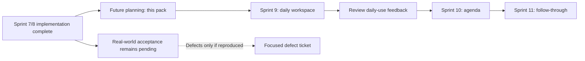

# Career Companion after Sprint 8

Status: **Sprint 9 implemented locally on 2026-10-03; Sprint 10/11 are implemented locally; live acceptance and v3 activation remain deferred.** See the [Sprint 9 execution report](../sprint-9/execution-report.md).

**Sprint 7/8 implementation is COMPLETE. Real-world acceptance is PENDING.** The office checkout and its execution reports are the baseline. Downloads artifacts are excluded. This planning pass uses local files and local Git only; it does not require publication, GitHub, Linear, or another machine.

## Product direction

Career Companion should become the owner's daily job-search workspace: open it, understand what needs attention, inspect the evidence, and deliberately decide what to do next. Keep Gmail ingestion, BYO AI, application status, corrections and automation intake as its foundation.

The [existing vision](../../product/product-vision.md) already asks “What do I need to do next?”. The next work should close that gap in the daily experience. It should not expand into job discovery, automatic applications, resume writing, coaching, a full email client or a general task manager.

## Evidence and documents

- [Completed-state review](completed-state-review.md): actual office source inspected and remaining capability gaps.
- [Architecture proposal](architecture.md): contracts, data ownership, concurrency, migrations and compatibility.
- [Acceptance and decisions](acceptance-and-decisions.md): live evidence still pending, existing ticket ownership, proposed choices.
- [Planning verification](planning-review.md): document checks and code-preservation evidence.
- [Historical roadmap through Sprint 8](../roadmap-through-sprint8-2026-10-03.md): preserved earlier sequencing; not an instruction to repeat completed work.
- [Planning index](../README.md): current entry point.

## Recommended sequence

| Sprint | Outcome | Local tickets | Readiness |
| --- | --- | --- | --- |
| [9 — Daily job-search workspace](../sprint-9/README.md) | See due work and review needs across the entire dataset; find an application quickly. | S9-01..S9-04 | Implemented locally; owner trial pending. No new AI contract or migration. |
| [10 — Interview and assessment agenda](../sprint-10/README.md) | Understand actual upcoming recruitment events, with uncertainty and correction visible. | S10-01..S10-04 | Local implementation verified; live v3 qualification/activation pending. See execution report. |
| [11 — Personal follow-through](../sprint-11/README.md) | Add a personal follow-up, defer work deliberately, and archive/restore applications. | S11-01..S11-04 | Local implementation verified; owner trial pending. See execution report. |
| Release track | Run safely outside the owner's local environment. | Existing AI-17, ADR-0004 reservation and release outline | Unscheduled; separate owner decision. Does not replace or reopen completed Sprint 8. |

Each sprint has four tickets. S/M/L describe relative scope, not commitments to dates. S10 was implemented and verified before S11. Collect daily-use feedback separately; do not infer live acceptance from fixtures.

The graph retains the original planning sequence. The owner subsequently authorized S10/S11 without blocking on live acceptance. Execution reports record the actual sequence. Acceptance can be gathered independently; it is not another implementation sprint. A real defect gets an evidence-backed ticket against the failed boundary.

## Why this order

The dashboard already completes/dismisses actions and reviews ambiguous mail/submissions. Rebuilding those capabilities would waste the finished work. Sprint 9 makes them useful across all pages with explicit coverage, complete counts and discoverability.

Interview dates and times are currently extracted as strings. A calendar would make those strings look more certain than they are. Sprint 10 first designs and validates temporal meaning, source references and rescheduling/cancellation review, then adds the agenda.

Personal reminders and archive change persistent user intent. Sprint 11 gives those changes revision checks and clear interactions with match correction and notifications. It does not introduce a new external notification schedule.

## Success criteria for product trials

Use real observed tasks, with dates and denominators, rather than invented adoption claims:

1. The owner can identify all overdue/today actions without paging through unrelated actions.
2. They can find a known application by company/title and effective status.
3. They can distinguish “no stored work” from “mail or AI has not caught up”.
4. Later, every confirmed agenda time has explicit temporal evidence or a recorded user correction; ambiguous times remain visibly unresolved.
5. Personal follow-ups and archive survive refresh, retries and match correction without duplicate work or lost history.

S9-04 records task outcomes and usability feedback. Live scheduling/Gmail/provider checks keep their own acceptance record. No benchmark is declared passed in this planning pack.
