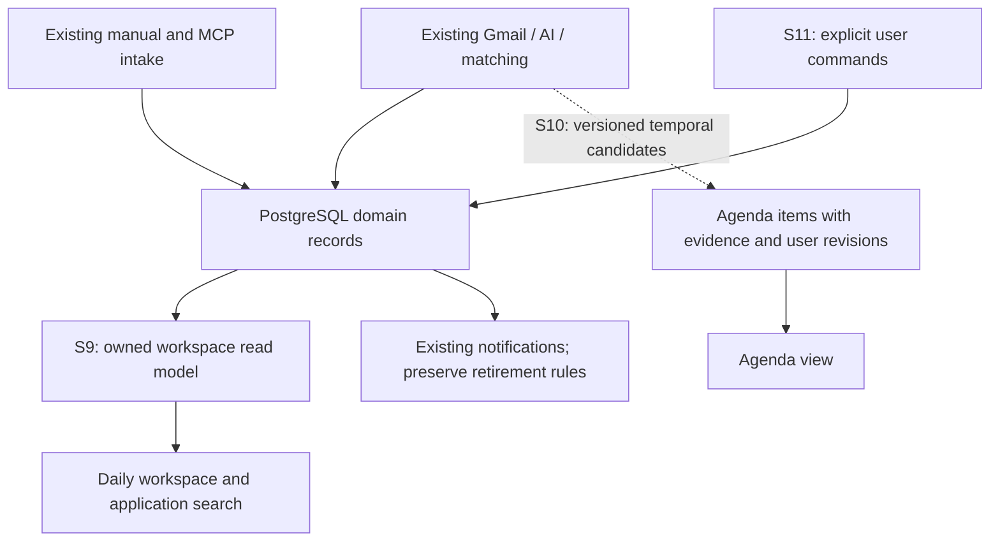

# Architecture for the next product sprints

Status: **Sprint 9 (§2) accepted and implemented locally, 2026-10-03; Sprint 10/11 accepted for local implementation, 2026-10-03. See their execution reports for verification and deferred live gates.** See [Sprint 9 evidence](../sprint-9/execution-report.md). See [decisions](acceptance-and-decisions.md).

## 1. Retain the completed foundation

Keep the existing Express/session API, Prisma/PostgreSQL, pg-boss, provider-neutral AI contracts and operation ledger, MCP intake, shared Zod contracts, React/TanStack Query and current UI primitives. Do not add a service, queue system, vector store, agent framework, full-text search service or calendar integration.

Keep user status, AI status, action lifecycle and actual event time distinct. Displaying an INTERVIEW status does not imply a future scheduled interview. Recording time is not event time.

## 2. Sprint 9: read models over existing data

### Workspace actions

Implemented authenticated endpoint:

`GET /api/workspace/actions?bucket=today&timeZone=Asia%2FKolkata&limit=20&offset=0`

- bucket: all, overdue, today, later, undated, snoozed; default all. Sprint 11 excludes archived applications and future-snoozed rows from all; snoozed has its own bucket.
- timeZone: validated IANA zone; frontend sends its resolved zone, or visibly uses Asia/Kolkata if unavailable. Invalid explicit values return 400, never silently use the server timezone.
- limit/offset: use current pagination validation and maximum 20.
- Response: existing ActionWithContext items, existing pagination metadata, and workspace metadata: generatedAt (server instant), timeZone, counts for all five disjoint buckets (including snoozed) and totalPending, plus nextTransitionAt (nullable server instant).
- Limit/offset apply after owner, active-PENDING and bucket predicates. Counts cover the full eligible dataset, not the returned page. Use the same server instant, zone and repeatable-read database snapshot for counts and rows within one request. Do not load all actions into JavaScript.
- Sort overdue/today/later by deadline then createdAt then id; undated by createdAt then id; all by bucket order overdue/today/later/undated and those keys. Null placement must be explicit.
- Pagination across separate requests is the existing offset model, not a frozen snapshot. A mutation or date-boundary change resets the active page. Document that limitation without claiming cursor stability.

| Stored deadline | Bucket at generatedAt |
| --- | --- |
| null | undated |
| DATE before the local calendar date | overdue |
| DATE equals local date | today, for the whole local day |
| DATE after local date | later |
| DATETIME before server instant | overdue, even if earlier today |
| DATETIME on the remaining local date | today |
| DATETIME on a later local date | later |
| Legacy non-null deadline with null precision | existing timestamp semantics; never reinterpret as confirmed DATE |

DATE is the existing UTC-encoded calendar date from S7-03; compare its calendar components without shifting it into a different day. Database and frontend formatting use the same tests. Reject malformed legacy values as a recoverable contract failure rather than silently counting them as undated. Pending actions on CLOSED/REJECTED applications remain visible: status alone does not cancel work.

Implemented `GET /api/workspace/review-summary` returns owner-scoped counts for the existing unmatched, ambiguous and pending external-submission queues, plus generatedAt. Reuse each queue's exact eligibility predicate, including relevance. These are distinct review categories, not a combined “jobs” total. Access/sync conditions are rendered from existing Gmail and AI settings endpoints, not copied into a second configuration system.

### Application discovery

Current additive refinement: [application discovery completion](../application-discovery/README.md) and [query/view contract](../application-discovery/api-contracts.md) add sort/source/unknown-status controls to the same route/domain without schema or MCP changes. The S9 defaults below remain compatible.

Extend existing `GET /api/applications` with optional q (trimmed, maximum 100 characters) and effectiveStatus (existing enum). Case-insensitive literal company/title substring search; escape LIKE wildcards if SQL is used. Empty q is no filter. Filter in PostgreSQL before pagination with the same effective-status precedence as deriveStatus, `userStatus ?? aiStatus`. Null derived status does not match a selected enum.

Keep current createdAt-desc/id-desc ordering and bounded recentEvent/pendingActionCount behavior. No new indexes without a demonstrated query need. Preserve ownership checks and current list/detail contracts.

### Frontend and compatibility

Use existing action, review and correction controls. Extend canonical query keys with every filter/zone; retain applicationCache's revision guard. Add workspace keys to appropriate processing-refresh and mutation invalidations. Keep independent errors for workspace actions, review summary, Gmail coverage and AI access; a failed read never means zero.

Sprint 11 adds earliest snooze expiry to nextTransitionAt. It is derived across all eligible pending actions, independent of selected bucket/page: the earliest future timed/legacy deadline plus one millisecond (overdue is strictly before generatedAt), or the next local midnight when dated work exists. Use server-relative delay from generatedAt, with a minimum one-minute refresh delay; focus/visibility restoration recomputes immediately. Never derive the global refresh boundary from page rows.

Filtered application caches must preserve membership as well as revisions: acknowledged status changes remove rows that no longer match. Invalidate and refetch pages to fill gaps, resetting an empty later page; do not optimistically insert into another page or reuse invalid pagination as authoritative. If merging newer manual state into a late GET changes membership, reread once; if it remains inconsistent, show a recoverable read error. Failed refreshes cannot display a known nonmatching row. Test update/clear, failed refetch and late reads.

Coverage is an explicitly partial observation, never an all-caught-up assertion. Show connection, last successful sync (or never synced), active/failed sync, known unscanned gap, AI access and PENDING waiting count independently. waitingEmails excludes PROCESSING and FAILED; even READY + zero waiting + recent sync leaves processing completeness unknown. Always label that limitation and link to Gmail processing details. Failed/malformed reads are unknown, never zero; validate Gmail responses at the workspace boundary. No new processing aggregate or existing backend-semantic change is required. “No stored pending actions” is the only global action-empty claim. An empty selected bucket says no actions in that bucket. Last-sync time is displayed without inventing a freshness threshold.

The view presents overdue/today/later/undated counts, paged selected work, review shortcuts and current coverage. Refresh on focus, explicit refresh, completed mutations, existing bounded processing refresh, and the next dataset-wide time bucket transition (no tighter than one minute). Clear timers when hidden/unmounted; no Gmail sync or AI call on view/read/refresh. Display timezone beside date grouping.

No database migration, prompt/catalog change, new background job or general dashboard redesign is expected in Sprint 9.

## 3. Sprint 10: trustworthy temporal meaning

Accepted local engineering policy: [ADR-0005](../../architecture/decisions/ADR-0005-job-search-agenda.md). Live extraction/v3 activation remains pending.

### Extraction and operation identity

extraction/v3 retains legacy extraction fields and adds at most five scheduleCandidates. Each includes kind (INTERVIEW or ASSESSMENT_DUE), change (SCHEDULED/RESCHEDULED/CANCELLED), rawWhen (max 200 characters), optional calendar date/time/source timezone, and a bounded evidence excerpt (max 280 characters). The input adds receivedAt as explicit context; missing context stays missing.

The backend validates components and converts to DATE, DATETIME or UNRESOLVED. A DATETIME requires an explicit unambiguous offset/zone and resolvable date/time. A display timezone never supplies a missing source timezone. DST folds/gaps, ambiguous abbreviations, conflicting dates and unsupported relative expressions remain unresolved. No invented midnight, duration or meeting URL. Any stored excerpt must match the bounded transient source text after documented whitespace normalization; otherwise store no quote and show evidence unavailable. Quotes are not a guarantee that the model interpreted them correctly.

Persist candidates in an additive nullable JSON envelope on AIProcessingResult with a schema/version tag and runtime validation. Explicitly map legacy fields and candidate JSON in pipeline persistence; do not blindly spread the new array into Prisma data.

A new contract does not authorize old-email reprocessing. Completed v2 results remain adopted, including matcher replay. At the first extraction claim for a genuinely unprocessed email select v3 only when enabled. Existing v2 operations (pending, processing, completed or held/unknown) retain v2 identity until their existing reconciliation finishes; keep the v2 contract definition available. Never bypass the held-operation approval by claiming a new version. Snapshot the selected version before a provider call. Classification version is unchanged.

### Agenda items

New AgendaItem concept:

- id, userId, applicationId, emailId, candidateKey, extractionVersion.
- Immutable extracted suggestion (including precision and evidence reference).
- Separate user-selected date/time/zone values and lifecycle (TENTATIVE, CONFIRMED, CANCELLED, COMPLETED).
- revision, createdAt, updatedAt; paired retiredAt/retiredReason.
- Unique (applicationId, emailId, candidateKey); candidateKey is stable within the persisted extraction envelope, not recomputed from a new provider response.
- Ownership constraints cover user/application/email consistency. All writes derive userId from the authenticated or worker context.

Matcher effect application projects candidates idempotently; an AI candidate is TENTATIVE, even when its date is syntactically clear. Date-only items may be confirmed as date-only. Unresolved items cannot be confirmed as timed events until the user supplies missing facts.

No auto-merge across emails. A later reschedule/cancellation creates a review candidate; the user cancels the old item and confirms the new one through separate explicit mutations. Partial completion remains visible. This is deliberately not an atomic cross-email reschedule feature. No action is created merely because an agenda item exists; the current Action remains the obligation, while an AgendaItem is a temporal view. Do not sum them into one “tasks” count.

### Ownership, edits and correction

Use owner-scoped revision-checked PATCH for confirm/edit/cancel/complete. Compare the captured revision before no-op; stale = 409; foreign/missing = 404. After uncertain response refetch; never automatic replay. Store the original AI suggestion separately so user edits are explainable.

Extend the existing correction transaction with agenda retirement/projection only when implementing S10. Preserve ADR-0003: user match lock → email → sorted applications → agenda rows in stable order. Agenda edits follow the same order, rechecking current match and retirement before writing. Source rows retire on move/unlink, remaining in history. Target existing rows reactivate with their own user decisions; a newly created target row carries source user decisions and records their origin. No provider calls or jobs during correction. Ignore/unlink still governs later-thread matching.

### Rollout

Additive migration only; do not normalize/rewrite all old AI results or backfill new provider output. Existing v2 mail can continue without agenda items, with explicit UI coverage. Use a default-off agenda/extraction-v3 activation setting until contract qualification and its decision are recorded. Turning it off stops new v3 selection/projection but does not erase user edits or make already selected/held v3 work lose its identity. Readers understand both versions.

Rollback keeps the additive schema and v2/v3 reconciliation code; a simple downgrade to a binary unaware of v3 is not a safe rollback. All fixture preservation lanes and cross-version paid-call recovery cases must pass.

## 4. Sprint 11: user-controlled follow-through

### Manual actions and intent revisions

Extend Action, not a parallel generic task system:

- nullable origin (EMAIL or USER); existing rows remain unchanged, with email-linked legacy rows displayed as EMAIL and other legacy rows as unknown source.
- actionRevision integer default 0 for future user-state comparisons.
- nullable clientRequestId (unique UUID) and creationPayloadHash for user-created follow-up idempotency.
- nullable snoozedUntil timestamp.

`POST /api/applications/:id/actions`: bounded description (1..500 trimmed characters), optional typed deadline and clientRequestId. Creates origin USER, type USER_FOLLOW_UP, emailId null, PENDING, without notification enqueue or AI/Gmail activity. Same owner/key/payload returns the same action; different payload is 409, cross-owner key is generic 404. Store the normalized initial payload hash so replay still identifies creation after later edits. No automatic creation retry in the UI.

An owned GET /api/actions/by-request/:clientRequestId returns the current action for creation reconciliation, or generic 404 for missing/foreign keys. Register the static route before dynamic IDs. A temporarily absent receipt is not proof that an in-flight create failed. Typed manual deadlines use either DATE with a validated YYYY-MM-DD calendar date, DATETIME with an offset-qualified ISO instant, or null; the UI must resolve the selected local timezone before sending a timestamp.

Revision checks cover new manual edit/snooze routes and new-client status writes. Existing clients may omit the revision for legacy email status-only updates; USER-origin actions require it. All accepted user changes and effect retirement/reactivation increment actionRevision. Compare first, then apply a same-value no-op without an increment. Never overwrite description/deadline of email-origin actions through the manual editor.

Snooze changes visibility, not deadline, pending status or AI evidence. While snoozedUntil is in the future, the action leaves normal daily buckets and appears in a separate snoozed view/count; total pending = visible bucket totals + snoozed. Wake is derived on read; no worker, no outbound reminder, no catch-up notification. Completion clears snooze. Retired actions cannot be snoozed or edited. Match correction retains existing target user decisions; a newly created target carries the source snooze and handled status. Manual emailId-null actions never move with email evidence.

### Reversible application archive

Add Application.archivedAt nullable and archiveRevision default 0. An owned expected-revision PATCH archives/restores; no delete, status change, AI processing, auto-unarchive or mass notification. Archive follows the emailMatches user advisory lock then application row lock. MCP keeps its distinct externalSubmissions advisory namespace; the shared application row lock, not a shared advisory namespace, serializes the archive-sensitive decision. Recheck archive under that row lock before linking, and re-evaluate a stale candidate as review instead of falling through to duplicate creation. Do not acquire both user advisory namespaces inside a transaction. Recheck archive state for user writes.

Default application lists, workspace actions and agenda omit archived applications; explicit archived/all filters and owned detail preserve access and history. Detail labels archive and requires restore before new manual work or agenda edits. Store incoming linked mail/events while archived and keep the application archived. Existing user/thread links remain valid; exclude archived apps from new company/role candidate selection. New explicit links to an archived target require restore.

MCP duplicate receipts keep their original application identity. A new submission that would match an archived application becomes pending review with a restore choice; do not silently create a duplicate application or expand MCP tools. This boundary is the accepted OD-20 extension of ADR-0002, implemented locally on 2026-10-03.

Notifications check active application state before claim and again before send; archive suppresses future eligible sends, but cannot retract an already in-flight external send. Restore never resends prior deliveries. Do not claim exactly-once delivery or solve the deferred outbox here.

## 5. Cross-cutting validation and limits

- Shared contracts are synchronized locally between sibling checkouts; no remote contract source in this workflow.
- New endpoints use runtime parsing, bounded pagination, stable tie-breakers and session-derived ownership. Logs contain identifiers/categories, not keys, email bodies, evidence excerpts or action text.
- S9: no provider/worker changes. S10: additive migration and extraction-version safeguards. S11: additive user state with revision/receipt invariants.
- Verification focuses on dataset-wide counts, timezone edges, ownership, stale/uncertain writes, cross-version replay, correction interleavings and preservation; add no test that merely repeats a schema definition.
- Use existing guarded fixture databases and smoke teardown. S10/S11 additive migrations are verified on guarded disposable fixture databases; no personal database is migrated.
- External calendar sync, push/email reminders, analytics, deletion/retention and deployment require separate scope. Proposed dates and sizes are not delivery commitments.
