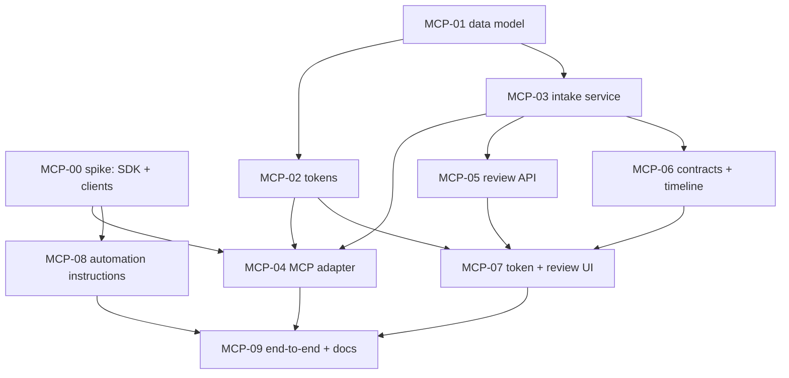

# MCP Feature Planning — Automation submissions through MCP

> **Roadmap update (2026-10-02):** MCP verification on the new PC is part of the [migration verification gate](../migration-verification/README.md) (MV-14: real-client check, MCP-09 part B steps 1–2 and 6–7). MCP-08 and part B steps 3–5 are in the [Sprint 6 closeout](../sprint-6/closeout/README.md), followed by the new [MCP-10](MCP-10-post-verification-corrections.md). Antigravity is **not yet verified**. Applications created by automation cannot be removed today (owner decision OD-10). No MCP work is planned in Sprint 7 or 8; productionization waits for a deployment decision. See the [roadmap](../README.md#4-mcp-where-verification-and-productionization-go).

Status: **implemented locally on 2026-10-02, except the two steps outside this laptop** (MCP-08 is staged in [MCP-08-automation-changes.md](MCP-08-automation-changes.md); MCP-09 part B is the owner's Antigravity run). See the [execution report](execution-report.md). This is feature planning, not a scheduled sprint; it is not assigned to any sprint. The architecture is decided in [ADR-0002](../../architecture/decisions/ADR-0002-automation-submissions-via-mcp.md); this plan allocates it into tickets. MCP-00 through MCP-09 are local IDs; no Linear identity, state or approval is assumed. Reviewed on 2026-10-02 against the code as it stands after BYO AI ([section L](#l-review-2026-10-02-after-byo-ai)).

## A. Goal

When `job-application-automation` confirms a submission, the user sees it in Career Companion:
- linked to the right application, or created as a new one, or queued for review;
- with no duplicates;
- with no submitted answers leaving the laptop;
- so that later Gmail emails can attach to the same application and timeline (they attach only when they name the company the same way; see section H).

## B. Scope decisions (owner, 2026-10-02)

- Direction: Career Companion hosts the MCP server, and the automation agent pushes to it (ADR-0002 §1–2).
- When no application exists at that company, one is created automatically.
  - This lifts the Sprint 6 non-goal "automatic application creation" **for automation submissions only**.
  - Gmail-driven creation stays out of scope.
- Submitted answers never leave the laptop.
- Only `applied` entries are sent. `skipped` and `needs_user` are not.
- The integration is opt-in in the automation repo, which is a public framework.
- The status display is "Applied · via automation" through `submittedVia`, without writing `aiStatus` or `userStatus`.

## C. Entry gate

- **Baseline:** the current local code is the engineering baseline: Sprint 6 plus the BYO AI implementation (ADR-0001, implemented 2026-10-02). Record backend, frontend and docs identity, including uncommitted changes, before MCP-01. No local git repositories exist and this plan creates none.
  - **Done 2026-10-02:** checksum manifest and tar snapshot, verified. See [baseline.md](baseline.md). The first snapshot was taken before BYO AI landed and is superseded.
  - **Immediately before MCP-01:** check that the manifests show 0 changed and 0 new files. If anything changed, take a new snapshot first.
- **Sprint 6 live gate:** this feature does not depend on the open Sprint 6 live Gmail and original-data gate. That gate stays open and is not waived here.
- **ADR-0001 (user-provided AI):** independent of this feature; this integration makes no AI calls. BYO AI was implemented first, so MCP builds on its code:
  - the MCP migration comes after `20261002120000_user_provided_ai`;
  - the Gmail fixture in MCP-09 needs a sealed fixture AI configuration, or the email waits for AI;
  - open BYO AI work (AI-15, AI-17, AI-18) does not run at the same time as this feature. AI-18's cleanup migration comes after the MCP migration.
- **MCP-00 must finish** before MCP-04 and MCP-08. Done.
- **Outside this laptop:** the `job-application-automation` repository and Antigravity are not on this office laptop (checked 2026-10-02), and the owner's rule is not to install extra AI clients here.
  - Before MCP-08, the owner provides a local copy of the automation repository.
  - The owner runs the Antigravity part of MCP-09 on their own machine.
  - MCP-01 to MCP-07 need neither.

## D. Non-goals

- Pull or sync APIs, read tools, resources, prompts or batch tools.
- Copying answers, resumes or account records.
- Changes to the Gmail matcher, `deriveStatus`, AI processing or timeline ordering.
- OAuth 2.1, multiple scopes or third-party clients.
- Unlinking after a link.
- Notifications for submissions.
- Executable code in `job-application-automation`.
- New infrastructure (Redis, queues, services).
- Deployment work.

## E. Tickets

### MCP-00 — Spike: MCP SDK and client compatibility (gate, ≤ 1 day) — **done 2026-10-02**

**Outcome:** SDK v2 chosen. Claude Code is verified. Codex is unsupported in this environment (owner, 2026-10-02). **Antigravity is the target client** and is verified in MCP-09. See the [spike report](MCP-00-spike-report.md). Its findings 1–5 are folded into MCP-02, MCP-04, MCP-07 and MCP-08 below.

- **Do:** a throwaway Express 5 app with SDK v2 (`@modelcontextprotocol/server` + `@modelcontextprotocol/express`), one dummy tool and a static Bearer check. Connect from the Claude Code and Codex versions in use, using a Bearer header taken from an environment variable.
- **Check:**
  - the Host/Origin defaults work behind a configurable host allowlist;
  - `structuredContent` and `isError` reach the client;
  - a plain HTTP 401 is surfaced clearly.
- **Done when:** the SDK line is recorded in ADR-0002's status field. Use v2 if both clients work; otherwise use `@modelcontextprotocol/sdk` 1.x. Exact client config snippets are captured for MCP-08. The spike code is deleted.

### MCP-01 — Data model and migration

- **Prisma (additive only):**
  - `IntegrationToken`: id, userId, name, tokenHash (unique), displayPrefix, scope, createdAt, expiresAt, lastUsedAt, revokedAt.
  - `ExternalSubmission`:
    - identity: id, userId, `source` enum (`AUTOMATION`), sourceRecordRef;
    - submitted fields: the ADR contract fields, submittedAt;
    - bookkeeping: receivedAt, tokenId (FK SetNull), `matchState` enum (`NEEDS_REVIEW | LINKED | CREATED | IGNORED`), `resolvedBy` (new enum `AUTOMATIC | USER`), applicationId (FK SetNull), resolvedAt;
    - do **not** reuse `MatchConfirmationSource`: its `AI_AUTO` value would label a rule-based match as AI;
    - `resolvedBy` and `resolvedAt` stay null while the state is `NEEDS_REVIEW`;
    - constraints: unique `(userId, source, sourceRecordRef)`; indexes `(userId, matchState)`, `(userId, receivedAt)` for the daily cap, and `(applicationId)` for `submittedVia`;
    - no CHECK that ties `matchState` to `applicationId`: the SetNull foreign key would then make user deletion fail.
  - `ApplicationEvent.externalSubmissionId`: nullable and unique, FK SetNull.
  - `userId` on both new tables cascades on user deletion, like existing models.
- **Migration:** one additive migration, `<timestamp>_automation_submissions`, with a timestamp after `20261002120000_user_provided_ai`.
- **Triggers** (same pattern as `20260926110000_domain_integrity`):
  - the submission's application must have the same owner;
  - the submission's token, when set, must have the same owner;
  - a submission's owner cannot change;
  - an event's submission must belong to the event's application owner.
- **Tooling:**
  - Migrate only through the existing `scripts/guarded-migrate.cjs`.
  - Add `scripts/verify-mcp-migration.cjs`, modelled on `scripts/verify-ai-migration.cjs`. This follows the per-feature pattern BYO AI used; `verify-migration-preservation.cjs` is pinned to the Sprint 6 migration.
  - Its upgrade lane applies every migration before the MCP migration and seeds synthetic users, applications, emails, events and actions. It then upgrades and checks that existing rows, triggers and unique indexes are unchanged.
  - Re-run the Sprint 6 and BYO AI lane scripts. They must still pass with the new migration present.
- **Done when:**
  - the fresh and upgrade lanes pass on synthetic data. The preserved-dataset run belongs to the open Sprint 6 live gate;
  - existing rows are untouched;
  - trigger tests reject cross-owner links.

### MCP-02 — Integration tokens (service + REST)

- **Service:**
  - **Create:** takes a name (1–100 characters) and an expiry in days. Generates `ccmcp_` + 32 random bytes in base64url (43 characters), stores the SHA-256 hash and a display prefix (the first 12 characters), and returns the plaintext once.
  - **List:** newest first, in the existing offset pagination envelope. Each item has id, name, display prefix, scope, created, expires, last used, revoked, and `status: active | expired | revoked`. Never the hash or plaintext.
  - **Revoke:** immediate. An unknown or foreign ID gets 404; revoking an already revoked token returns it unchanged.
  - **Verify:** rejects anything not shaped `ccmcp_` + 43 base64url characters before any database lookup. Then a hash lookup; rejects revoked or expired tokens; updates `lastUsedAt`. It must return `expiresAt`, because the SDK's bearer check rejects tokens without one (spike finding 1).
  - **Limits:** expiry by default 90 days (at most 365); at most 5 active tokens per user.
- **Routes** (session auth, existing `requireAuth`): `POST /api/integration-tokens`, `GET /api/integration-tokens`, `DELETE /api/integration-tokens/:id`. DELETE means revoke: it sets `revokedAt` and keeps the row for the audit trail. Shared zod contracts in `src/contracts/`, exported from its `index.ts`.
- **Done when:**
  - a token works only for its owner;
  - revoked and expired tokens fail;
  - no plaintext appears in logs or responses after creation (tested).

### MCP-03 — Submission intake service (domain, no MCP code)

- `backend/src/services/externalSubmission.ts`:
  - **Validate** with the strict zod schema from the ADR. Required strings are trimmed before their length check.
  - **Canonicalize** the URL: drop the fragment and any user name or password; keep only `jk`, `currentJobId`, `gh_jid`, `jobId` in the query.
  - **Truncate** `confirmationText` to 300 characters instead of rejecting it. Every other limit rejects.
  - **One transaction per call, under a per-user advisory lock.** Use the two-key form, `pg_advisory_xact_lock(<fixed MCP namespace>, hashtext(userId))`, so it cannot collide with single-key locks such as pg-boss's or the smoke lane's. Inside it:
    1. if the ref already exists, return `already_recorded` with the existing record ID and log whether the payload differed;
    2. enforce the daily cap (`MCP_DAILY_SUBMISSION_LIMIT`, default 500 new records per user per UTC day, counted from `receivedAt`);
    3. insert the record;
    4. match with the rule in ADR-0002 §7 and the edge-case rules below. Gmail matcher code is untouched;
    5. create or link, together with the `AUTOMATION_SUBMITTED` event. Set `appliedAt` only if it is empty.
  - **Why the lock:**
    - A crash can't leave a record without its match state.
    - Two different submissions for a new company can't both create an application.
    - Existence is checked before insert because a P2002 inside a Prisma interactive transaction aborts it. A P2002 that still occurs maps to `already_recorded` after the transaction.
  - **Matching keys and edge cases** (ADR-0002 §7 does not spell these out; each follows its "anything uncertain goes to review" rule):
    - **Company key:** lowercase, split on every character that is not a–z or 0–9, then drop trailing words that are in the suffix list, repeatedly, always keeping the first word. Join the rest. Examples: "Acme Pvt. Ltd." → `acme`; "Co" stays `co`. The same function is applied to the user's applications.
    - **Title key:** the existing normalization.
    - An application has **no title** when its `jobTitle` is null or its title key is empty.
    - If the submission's company key or title key is **empty** (for example a name with no Latin letters or digits), the result is `NEEDS_REVIEW`. An empty key never matches.
  - **A created application** gets the submitted company and job title (trimmed), the location if given, and `appliedAt = submittedAt`. `aiStatus` and `userStatus` stay null.
  - **The `AUTOMATION_SUBMITTED` event** sets `externalSubmissionId` and leaves `emailId`, `oldState`, `newState`, `description` and `provenance` null. Everything the timeline shows comes from `sourceSubmission` (MCP-06), so the event is never shown as AI output.
- **Done when the tests cover:**
  - the full matching matrix: 0, 1 or several candidates; title equal, different or missing; suffix variants; suffix-only names; empty keys;
  - replay of the same ref, including with a changed payload;
  - two concurrent calls with the same ref, giving exactly one record and one event;
  - two concurrent calls with different refs for a new company, giving exactly one created application;
  - `confirmationText` over 300 characters is truncated, not rejected;
  - the rate cap;
  - no change to `aiStatus` or `userStatus`.

### MCP-04 — MCP endpoint adapter

- `backend/src/mcp/`:
  - server factory; register `record_application_submission` with the MCP-03 schema, annotations and description;
  - map service results to `structuredContent`, and errors to `isError` codes. An unexpected error maps to `unavailable`;
  - bearer middleware using the MCP-02 verification, which sets the user from the token.
- **Mounting:**
  - `POST /mcp` is mounted **first** in `backend/src/index.ts`, before every global middleware: `cors`, `express.json`, `cookieParser` and `session`. The global JSON parser (100 KB) would otherwise read the body first, and the route's 32 KB limit would never apply;
  - route-local 32 KB JSON limit;
  - GET and DELETE return 405;
  - host allowlist `MCP_ALLOWED_HOSTS`;
  - `Origin` checked against `MCP_ALLOWED_ORIGINS` (default empty). Requests without `Origin` pass.
    - Rejecting every `Origin` could block IDE-based clients such as Antigravity, which may send one.
    - Auth is a Bearer header, never a cookie, so a web page cannot ride the user's session.
    - MCP-09 records what Antigravity sends; any fix is configuration, not client-specific code.
- **Configuration** (add all three to `.env.example` and `validateProductionConfig`):
  - `MCP_ALLOWED_HOSTS`: comma-separated hostnames, without scheme or port. Outside production it defaults to `localhost,127.0.0.1,[::1]`. Production startup fails when it is unset. Behind CloudFront and the ALB, list the `Host` the backend actually receives.
  - `MCP_ALLOWED_ORIGINS`: comma-separated hostnames; the SDK compares the `Origin` hostname and ignores the port. Default empty.
  - `MCP_DAILY_SUBMISSION_LIMIT`: an integer from 0 to 5000, default 500; 0 stops all new submissions. An invalid value fails startup in production, like `AI_USER_DAILY_CALL_LIMIT`.
- **Wiring:**
  - **Do not add `@modelcontextprotocol/express`.** It re-types `req.auth` for the whole app as the SDK's `AuthInfo`, and the backend already uses `req.auth` for the session user in 28 places. A scratch typecheck on 2026-10-02 failed with `Property 'user' does not exist on type 'AuthInfo'`.
  - Use the runtime-neutral core that package wraps: `validateHostHeader`, `validateOriginHeader`, `verifyBearerToken` and `bearerAuthChallengeResponse` from `@modelcontextprotocol/server`, as small middleware in `backend/src/mcp/`.
  - Serve `createMcpHandler(factory)` (from `/server`) through `toNodeHandler` (from `/node`). The node adapter reads the verified `AuthInfo` from the request's `auth` field; attach it only inside the MCP router.
  - Pin exact versions: `@modelcontextprotocol/server` 2.2.0 and `@modelcontextprotocol/node` 2.1.0.
- **Router-level JSON error handler** (413/400) with no stack traces (spike finding 2).
- **Validation errors:** input that fails the strict schema reaches the client as `isError` with code `invalid_input` and the failing field names, never submitted values. MCP-08 depends on this. If the SDK's own validation message cannot carry it, validate inside the handler with the same strict schema.
- **Logging:** one log line per call with no payload values, written at the router or transport level so that calls rejected by validation are logged too (spike finding 3). Never log the `Authorization` header or any part of a presented token.
- **Done when the integration tests**, using the official SDK client against the real app, **cover:**
  - success, `already_recorded`, `invalid_input` with an unknown key (code and field name), and `rate_limited`;
  - 401 for missing, malformed, expired and revoked tokens;
  - a session cookie alone is rejected, and so is the development `X-Development-User` header;
  - a valid integration token on an `/api` route gets 401;
  - a `Host` or `Origin` not on its allowlist gets 403;
  - 405 on GET;
  - a validation failure is logged without payload values.

### MCP-05 — Submission review API

- **Routes:**
  - `GET /api/submissions/pending`: owner-scoped, paginated with the existing offset envelope.
  - `POST /api/submissions/:id/resolve` with `{ action: "link", applicationId } | { action: "create" } | { action: "ignore" }`.
- **Rules:**
  - only `NEEDS_REVIEW` can be resolved, and resolution is final;
  - every resolution sets `resolvedBy = USER` and `resolvedAt`. Link sets `LINKED`, create sets `CREATED`, ignore sets `IGNORED`;
  - link and create add the event in the same transaction;
  - create builds the application exactly as the automatic path does (MCP-03);
  - `appliedAt` rules match the automatic path: link sets it only if empty; create sets it to `submittedAt`;
  - the same per-user advisory lock as MCP-03 is used.
- **Errors,** as on the email resolve route:
  - a missing or foreign submission gets 404 `NOT_FOUND`;
  - a submission that is no longer `NEEDS_REVIEW` gets 400 `BAD_REQUEST`;
  - a foreign or absent application gets 403 `FORBIDDEN`.
- **Pending items** carry the stored submission fields, never the token ID. Shared zod contracts.
- **Done when:** a concurrent double resolve gives one outcome, and the tests pass.

### MCP-06 — Application contracts and timeline

- **Backend:**
  - `ApplicationResponse.submittedVia: 'AUTOMATION' | null`, derived from linked or created submissions;
  - event responses include a bounded `sourceSubmission { platform, destinationHost, submittedAt, confirmationText }` for `AUTOMATION_SUBMITTED`, owner-checked like `sourceEmail`. For this event `analyzedBy` (added by BYO AI) is null;
  - `deriveStatus` and its response check are unchanged;
  - `submittedVia` is present on every `ApplicationResponse` path (create, list, detail, status PATCH), because Sprint 6 runtime validation treats a missing field as an error. All four already go through the one mapper, `mapToResponse`;
  - `recentEvent` (list page) also carries `sourceSubmission` for this event type;
  - for the same reason, `sourceSubmission` is present on every event and every `recentEvent`, null when it does not apply.
- **Frontend** (after `npm run sync-contracts`):
  - the status badge shows "Applied · via automation" only when `statusSource === 'UNKNOWN'` and `submittedVia` is set;
  - the timeline renders the event as "Submitted via automation", with the submission time and recording time labelled separately and the confirmation as plain text;
  - this event is never labelled "AI interpretation" or "Source email unavailable" (today's detail page does both for any event without an email);
  - the list page's recent-event line shows "Submitted via automation".
- **Done when:** the contract and frontend tests pass, including the status precedence combinations with `submittedVia`.

### MCP-07 — Frontend: token settings and review panel

- **Token page:**
  - create a token with a name and expiry;
  - show the plaintext once with a copy button and a warning;
  - call the create API directly, not through `useMutation`, and keep the plaintext only in component state, cleared on unmount. This keeps it out of TanStack's caches, as BYO AI does for API keys;
  - list tokens (name, prefix, status, last used, expiry) and revoke them;
  - warn during a token's last 14 days, because an expired token makes the tool silently disappear in Claude Code (spike finding 4).
- **Placement:** a new top-level route, `/automation` ("Automation"), next to "AI Provider" in `Sidebar.tsx` and `MobileNav.tsx`. This mirrors the Gmail and AI pages. BYO AI built `/ai` as its own page and ruled out a shared settings area (BYO AI plan, frontend placement), so there is no Settings page to join.
- **Dashboard:**
  - a pending-submissions panel next to the ambiguous and unmatched email panels;
  - actions: link to an existing application (picker), create, or ignore;
  - submission fields come from the automation and are untrusted: render them as plain text. If the job URL is shown as a link, use only the stored `http`/`https` value, with `rel="noopener noreferrer"`.
- **Done when:** keyboard and mobile checks pass, and an uncertain save follows the existing recovery pattern without automatically resubmitting.

### MCP-08 — Automation repo: opt-in instructions and setup

In `job-application-automation`, no code:

- **Prerequisite:** a local copy of the repository; it is not in this workspace (section C). The file names below come from ADR-0002's reading of the repository. Check them against it before editing.
- **Opt-in flag:** add `Career Companion sync: yes | no` to `personal_data/profile_template.md` (default `no`).
  - The agent uses the integration only when it is `yes`.
  - The flag is what lets the agent tell "not set up" from "set up but broken".
- **AGENTS.md:** a new optional section, used only when the flag is `yes`.
  - Call it once after appending an `applied` entry, with values copied from that entry:
    - `sourceRecordRef` from the date folder and the entry heading time;
    - `submittedAt` with the local UTC offset (for example from `date +%z`);
    - `platform` = the **actual application workflow**, one of the 8 contract values; Workday wins whenever a Workday form was used. The source choice (for example `we_work_remotely`) goes in `discoverySource`, never in `platform`;
    - **never** submitted answers, resume, credentials, or `skipped` / `needs_user` entries.
  - Add `- Career Companion sync: sent | failed | unavailable` to the entry. Never block or retry-loop an application on sync failure.
  - On `invalid_input`, write `failed: invalid_input <field>`, include it in the end-of-session summary, and do not retry until the entry is fixed.
  - At START: if the flag is `yes` but the tool is absent (a bad or expired token makes it silently disappear, spike finding 4), mark entries `unavailable` and tell the user once to check the client's MCP server status (Antigravity's MCP panel, or `claude mcp list` in Claude Code).
  - On the user's request, "sync Career Companion for YYYY-MM-DD", replay that day's `applied` entries whose sync line is not `sent`.
- **README:** setup steps.
  - Create a token in Career Companion.
  - **Antigravity (primary):**
    - put the server in the **global** `~/.gemini/config/mcp_config.json` (`serverUrl` + `headers`), and `chmod 600` that file;
    - **never** use `.agents/mcp_config.json` in this repo;
    - allow `mcp(career-companion/record_application_submission)`.
  - **Claude Code (optional):** `claude mcp add --scope local` with `'Bearer ${CC_MCP_TOKEN}'`, plus an allow rule for the tool. Snippets are in the MCP-00 report.
  - Add `.agents/mcp_config.json` to this repo's `.gitignore` as a guard against committing a token.
  - Explain that answers stay local.
- Update the walkthrough checklist (AGENTS.md §12) with three new scenarios: tool absent, sync failure, replay.
- **Done when:** the integration is invisible to users who have not configured it.

### MCP-09 — End-to-end verification and documentation

- **Fixture:** a daily file containing a created case, a linked case, a needs-review case, and a skipped entry that must not be sent.
- **Part A — automated, on this laptop:**
  - add an MCP scenario to the existing real-worker smoke harness (`frontend/scripts/smoke-stabilization.mjs`). The official SDK client sends the fixture's `applied` entries twice. That the skipped entry is never sent is agent behaviour, so part B checks it;
  - confirm: no duplicates, the expected match states, and the timeline shows the events;
  - a Gmail fixture email then matches the created application through the real workers. The fixture user needs a sealed fixture AI configuration and the harness's fake `createProviderClient` (BYO AI); without them the email waits for AI and never matches. No live Gmail or AI provider;
  - optionally, Claude Code in headless mode with `--mcp-config` and no permanent configuration, as in MCP-00.
- **Part B — Antigravity, run by the owner on their own machine** (section C):
  - Career Companion running locally there, and Antigravity with the automation repo. This is the first Antigravity compatibility check;
  - replay the fixture twice and confirm the same results as part A;
  - if Antigravity fails, run part A's SDK client against the same server to tell server faults from client faults;
  - record what `Origin`, if any, Antigravity sends, and whether it accepts an `http://localhost` `serverUrl`.
- **No live job applications.** Synthetic results are not called live evidence.
- **Documentation updates:** see section I.
- **Done when:** all of section G holds, with evidence recorded in `execution-report.md`.

## F. Dependency graph

MCP-00 and MCP-01 can run in parallel.

## G. Definition of done

- [x] MCP-00 outcome recorded in ADR-0002; SDK line chosen (v2, 2026-10-02).
- [x] Codex marked unsupported in the owner's environment (2026-10-02).
- [ ] Antigravity connects, lists and calls the tool against local Career Companion (MCP-09 part B, run by the owner).
- [x] Migration is additive; fresh and upgrade runs preserve existing data; ownership triggers are tested.
- [x] Tokens: shown once, hashed, scoped, expiring, revocable; no plaintext in logs.
- [x] `/mcp` accepts only valid Bearer tokens; session cookies, the development header, GET, and non-allowlisted `Host`s and `Origin`s are rejected. Integration tokens are rejected on `/api`.
- [x] Unknown input keys are rejected, so there is no field for answers, resume data or credentials.
- [x] Replaying the same `sourceRecordRef` never creates a second record or event, including under concurrency.
- [x] Matching follows ADR-0002 §7 and the MCP-03 edge-case rules exactly; the Gmail matcher is unchanged.
- [x] `aiStatus`, `userStatus` and `deriveStatus` are unchanged; "Applied · via automation" appears only when the status source is `UNKNOWN`.
- [x] The timeline shows automation events distinctly from email and AI events.
- [x] Review resolve works and is final; concurrent resolves give one outcome.
- [ ] The automation integration is opt-in and never blocks an application. *(Staged in MCP-08; needs the automation repository.)*
- [x] Focused and full tests, typecheck, lint, build and contract sync pass in backend and frontend.
- [x] The end-to-end fixture run (MCP-09 part A) passes twice; no live applications.

## H. Risk register

| Risk | Mitigation / gate | Owner |
| --- | --- | --- |
| Clients do not work with SDK v2 / spec 2026-07-28 | MCP-00 gate; fall back to SDK 1.x | Backend |
| Agent sends a wrong or hallucinated submission | Strict schema, review queue for anything uncertain, user can ignore; the daily file stays the source of truth | Backend / product |
| Prompt injection from a job page triggers tool calls | Write-only tool, minimal result, user from token only, daily cap | Backend |
| Duplicate applications from name variants | Suffix-stripped company key; anything uncertain goes to review | Backend |
| Review queue grows unattended | Dashboard panel with a count; ignore is one click | Frontend |
| Token leak from the laptop | Single write scope, expiry, revoke, `lastUsedAt` visible | Backend / user |
| Sensitive data in logs | Log only IDs and outcomes; tested | Backend |
| Permission prompt fatigue (Antigravity "Ask" mode, Claude Code prompts) | Setup docs allow this one tool | Automation |
| Antigravity remote-MCP immaturity (public reports: tools not invocable, stalls) | Verify early in MCP-09 with an SDK-client control; the server stays standards-only, with no client-specific workarounds | Backend / owner |
| Token stored in plain text in Antigravity config | User-level file outside repos, `chmod 600`, short expiry, write-only scope, revoke; `.agents/mcp_config.json` gitignored in the automation repo | Owner / automation |
| Backfill looks out of order on the timeline | Separate submitted and recorded labels; accepted limitation | Frontend |
| More AMBIGUOUS Gmail matches once several applications exist at one company (the Gmail matcher treats a missing email title as matching any role) | Existing ambiguous-email review; accepted limitation; the Gmail matcher stays unchanged | Product |
| A Gmail email names the company differently from the automation (for example "Acme" vs "Acme Inc."), so it does not attach to the created application: the Gmail matcher is exact and has no suffix stripping | The email lands in the existing unmatched-email review. Accepted limitation; changing the Gmail matcher is out of scope | Product |
| Two different submissions share a `sourceRecordRef` (for example two agent sessions writing in the same second), so the second is reported `already_recorded` | The automation applies one job at a time in one session; a repeat with a different payload is logged | Automation / backend |
| Floods of unauthenticated or invalid requests | Each costs at most one indexed lookup; tokens are format-checked before any lookup. The app has no per-IP limiter today; edge rate limiting is deployment work (out of scope) | Backend / deployment |
| `@modelcontextprotocol/express` re-types `req.auth` and breaks the backend typecheck | Not used; MCP-04 uses the SDK's runtime-neutral core | Backend |
| Submissions silently lost to `invalid_input` (for example a source name used as `platform`) | MCP-08 platform mapping; `failed: invalid_input <field>` in the entry and session summary; `confirmationText` truncated, not rejected | Automation / backend |
| MCP and open BYO AI work (AI-15, AI-17, AI-18) both touch migrations, `index.ts` and the frontend | BYO AI landed first (2026-10-02). Do not run them at the same time; AI-18's migration comes after MCP's. MCP's page is its own route (MCP-07) | Owner |
| Scope creep into sync, OAuth or read tools | Non-goals in section D; ADR-0002 "Not part of this decision" | Feature owner |

## I. Documentation updates during implementation

| File | Change |
| --- | --- |
| [Domain model](../../domain/domain-model.md) | `ExternalSubmission`, `IntegrationToken`, `AUTOMATION_SUBMITTED` event, `submittedVia`, ownership rules |
| [MVP architecture](../../architecture/mvp-architecture.md) | MCP adapter boundary, `/mcp` middleware order, token auth |
| [User flows](../../product/user-flows.md) | Token setup, submission review, automation-sourced timeline entries |
| [Product vision](../../product/product-vision.md) | Clarify: Career Companion still does not apply to jobs; it can receive submissions from a user's own tool |
| backend README and `STABILIZATION.md` | Endpoint, environment variables (`MCP_ALLOWED_HOSTS`, `MCP_ALLOWED_ORIGINS`, `MCP_DAILY_SUBMISSION_LIMIT`), token routes, tests, the MCP migration lane command |
| frontend README | New Automation page and review panel; contract sync |
| automation README / AGENTS.md | MCP-08 |
| ADR-0002 | MCP-00 outcome in the status field |

## J. Defaults to confirm before MCP-02 and MCP-03

These are reasonable defaults, not open product questions. Change them before coding if wanted.

- Token expiry: 90 days by default, 365 at most. At most 5 active tokens per user.
- Daily cap: 500 new submissions per user per UTC day.
- Legal suffix list: inc, incorporated, llc, llp, ltd, limited, pvt, private, corp, corporation, co, plc, gmbh.
- URL query allowlist: `jk`, `currentJobId`, `gh_jid`, `jobId`.

## K. Baseline before MCP-01 — decided and done

- **Decision (owner, 2026-10-02):** record the baseline as a SHA-256 manifest plus a tar snapshot, stored outside the repositories. No git.
- **Done and verified 2026-10-02, after BYO AI:** see [baseline.md](baseline.md) for snapshot paths, checksums, timestamp, exclusions and verification evidence. It covers the backend, frontend and docs repositories. The first snapshot predates BYO AI and must not be used to list or roll back MCP changes.
- MCP-01 may start only on the owner's explicit go-ahead, after the check in section C.

## L. Review 2026-10-02 (after BYO AI)

The plan was checked against the code after BYO AI landed. Changes made:

- **Baseline** re-taken on the current code, now including the docs repository; the first snapshot predates BYO AI (C, K).
- **MCP-04 wiring:** `@modelcontextprotocol/express` dropped because it breaks the backend typecheck; the SDK's runtime-neutral core is used instead. The endpoint is mounted before the global JSON parser too. Configuration defaults and production checks are defined, and so is the `invalid_input` error shape.
- **MCP-01:** migration ordering after BYO AI, a dedicated migration lane script, two indexes, and a token-owner trigger.
- **MCP-03:** matching edge cases (suffix stripping, empty keys, untitled applications), created-application fields, event fields, and the lock key.
- **MCP-05:** `resolvedBy = USER` replaces a stray `matchConfirmedBy`; error codes follow the email resolve route.
- **MCP-07:** its own `/automation` page, because BYO AI built `/ai` as a separate page and there is no Settings page.
- **MCP-08 and MCP-09:** the automation repository and Antigravity are not on this laptop. MCP-09 is split into an automated part and an owner-run Antigravity part. The Gmail fixture needs a fixture AI configuration.
- **Risks added:** company-name mismatch with the Gmail matcher, `sourceRecordRef` collisions, request floods, and the SDK type conflict.
