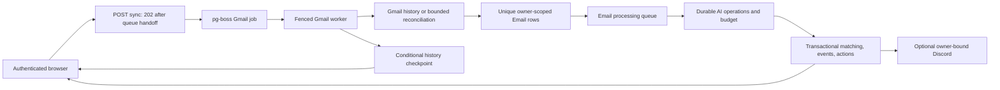
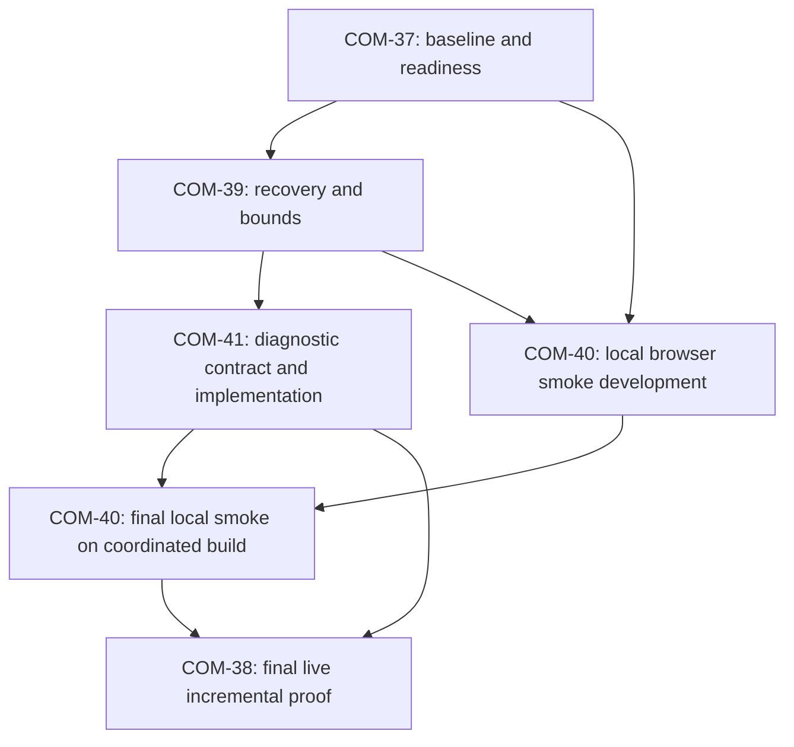

# Sprint 5 — Gmail Incremental Sync & Reliability

Planning status: implementation-ready local draft, 2026-09-26. No Sprint 5 implementation or live verification was performed while preparing this pack. Sprints 1–4 remain completed. The stabilization work is an input to this sprint, not a replacement roadmap.

## Sprint goal

Prove that Career Companion maintains its existing Gmail dataset over time: discover a controlled real mailbox change through the authenticated API and background worker, persist it once, advance history safely, recover from bounded failures, and show the resulting email/application state in the browser. Preserve every baseline email in the approximately 1,620-email dataset, existing user decisions, and completed AI work. Use the current PostgreSQL/Prisma/pg-boss architecture and small, actionable diagnostics.

## Start here

1. [Architecture review and evidence](architecture-review.md) distinguishes current code, verified historical audit results, source-level gaps, and pending live evidence.
2. [Verification runbook](verification-runbook.md) defines dataset preservation, environment separation, evidence, and existing commands.
3. Execute the five tickets below. Each contains all 19 requested engineering sections.
4. [Linear conversion notes](linear-conversion.md) provide suggested fields and an explicit identifier-conflict check. No Linear issues have been created or changed.
5. [Planning review](planning-review.md) records findings resolved in this pack and the remaining execution gates.

| Ticket | Intended work after stabilization | Suggested priority / size |
| --- | --- | --- |
| [COM-37 — Establish the preserved-dataset baseline and Sprint 5 readiness gates](COM-37.md) | Record deployment, schema, owner/mailbox, dataset identities, backlog, and safe verification environments; reconcile stale documentation. | High / 3 points |
| [COM-38 — Prove live Gmail incremental sync and repeat-sync idempotency](COM-38.md) | Mandatory controlled real Gmail change, actual worker path, before/after preservation evidence, and repeat sync. | High / 5 points |
| [COM-39 — Close Gmail crash-retry and completion-fencing gaps](COM-39.md) | Fix evidenced claim recovery and false-success paths; establish transport bounds; extend failure tests without replacing existing safeguards. | High / 8 points |
| [COM-40 — Complete the critical Gmail-to-application browser smoke](COM-40.md) | Extend the installed Puppeteer browser harness to execute real local workers with fixture provider adapters; verify UI completion and failure recovery. | High / 5 points |
| [COM-41 — Correlate Gmail sync outcomes, counts, retries, and worker health](COM-41.md) | Complete structured logs and a small operational runbook using existing queue and domain state. | High / 5 points |

Total suggestion: 26 relative points, not a calendar estimate or imported Linear estimate. COM-39 has the most uncertainty; reduce its estimate only after the crash and transport reproduction tests establish the exact change. Labels and priorities are recommendations, not claims about existing Linear configuration.

## Sprint architecture summary

The signed-in browser submits `POST /api/gmail/sync`; Express derives the owner from authentication, reserves the connection, and returns `202 { accepted: true }` after a pg-boss handoff. A Gmail worker acquires a fenced attempt and reads `lastHistoryId`. Normally it pages Gmail history; an absent/expired checkpoint uses the existing bounded 90-day INBOX reconciliation scan without deleting stored rows. Each eligible message is persisted under the existing `(userId, gmailMessageId)` uniqueness constraint and offered to the email queue. Only successful ingestion/handoff and a still-owned final update publish the next checkpoint. Email workers separately fetch transient content, reuse or reserve durable AI operations, and transactionally match applications/create events and actions. The browser polls ingestion status and email processing separately. Structured logs correlate the request, attempts, counts, queue state, and failures. No automatic scheduled Gmail trigger exists in the inspected code; this sprint proves repeatable manual sync over time.

## Dependency graph and execution order

Recommended completion order: **COM-37 → COM-39 → COM-41 → COM-40 → COM-38**. Telemetry design and browser harness preparation can start after COM-37; complete them against COM-39's agreed attempt lifecycle. Run the final local browser regression after implementation changes, then perform COM-38 on that same coordinated build. COM-40 closes from its local worker/browser evidence without depending on COM-38; the sprint closes only after the separate live Gmail proof. If later relevant code changes, repeat affected local checks before refreshing live evidence. These are stages of the same five tickets, not new issue IDs. This order changes dependencies, not the sprint's original intent.

## Risk register

| Risk / source | Impact | Mitigation and required evidence | Owner |
| --- | --- | --- | --- |
| Wrong checkout/deployment; audit branches were local-only in the audit report | Tests prove obsolete code or mixed workers bypass safeguards | Record exact runtime commits and all worker versions; compare with inspected commits; resolve rollout prerequisites before live sync | COM-37 |
| Dataset accidentally treated as a disposable fixture | Irrecoverable loss or false proof from a clean import | Protected backup, owner-scoped identity manifest, separate guarded test DB; zero reset/delete/reseed operations on baseline | COM-37/38 |
| Expired `lastHistoryId` | Reconciliation rather than true incremental proof | Preserve rows on fallback; establish a valid anchor, then introduce a new change and run a distinct history-only proof | COM-38/39 |
| Worker dies after replacing queued claim | Retried job can be acknowledged without ingesting | Correlatable request/attempt claims, expiry-safe reclamation and real pg-boss crash tests | COM-39 |
| Claim lost before final write | Success reported despite no checkpoint commit | Check affected-row count; report superseded outcome, never success | COM-39/41 |
| OAuth refresh or nested HTTP retries outlast lease/job | Overlapping attempts and misleading four-minute bound | Inspect installed transports, bound refresh and Gmail calls, propagate cancellation, test absolute deadline and fencing | COM-39 |
| Quota, provider outage, retry amplification | Delays and repeated provider load | Reason-aware safe categories, bounded delayed retries; record transport attempts separately from job retries | COM-39/41 |
| Repeated/partially ingested items and queue-send gaps | Duplicate effects or stranded processing | Preserve uniqueness/AI claims; test pending recovery, queue suppression, terminal/unknown outcomes | COM-39 |
| Large history window or many old stored rows | Four-minute restart can repeat a prefix; no durable page cursor | Representative 1,620-row fixture plus multi-page/fault tests; measure forward progress; add continuation state only if failure is reproduced | COM-39 |
| AI backlog or changed operation versions | Unexpected paid calls on historical mail | Baseline backlog and call budget first; preserve versions/checkpoints; zero new calls for previously completed records | COM-37/38/39 |
| Browser polling stops after ingestion but before matching | User sees stale application or no useful failure | Test delayed processing, existing cached application, API timeout, failure and retry; use targeted bounded refresh | COM-40 |
| Counts omit filtered/404 messages; generic error names | Operators cannot explain loss or distinguish failures | Reconciled counters on success and failure, safe category/attempt/job correlation | COM-41 |
| Mailbox/account switch or cross-owner work | Wrong user's mail or state is accessed | Preserve same-mailbox reconnect and ownership guards; test two-user boundaries | COM-39/40 |
| Old docs/COM-37 comment conflict with supplied roadmap | Wrong issue updated or unsafe replay guidance followed | Preserve requested mapping; reconcile identifiers before conversion; document authority and stale guidance | COM-37 |

## Definition of done

- All five tickets have evidence against recorded final backend/frontend commits, with local simulation and live-provider evidence explicitly separated.
- The baseline count is measured, not assumed to be exactly 1,620. Every baseline `(id, userId, gmailMessageId)` and immutable email metadata value survives. Existing user choices and completed AI results are preserved; additions and permitted processing changes are explained individually or by an audited manifest comparison.
- COM-38 proves a real in-scope Gmail change, history-path discovery, exactly one correct row, repeat-sync idempotency, successful checkpoint progression, useful counts/timing, and no unexplained loss or duplicate effects.
- COM-39 covers duplicate requests, mid-page/provider/enqueue failure, refresh failure, interruption, retries, supersession, and bounded execution. No unresolved data-loss/false-success finding remains; uncertainty is not silently turned into success.
- COM-40's small browser suite drives real local API/queue/worker/domain behavior and user-visible recovery. It does not mutate DB sync state to fake completion.
- Live Gmail discovery/persistence/checkpoint proof is mandatory; successful live Gemini extraction and live Discord delivery are optional supplementary evidence. Record any downstream hold/failure accurately and diagnose unexplained regressions; an optional provider outage does not turn proven Gmail ingestion into failure or authorize resetting work.
- COM-41 explains success/failure/retry/expired-worker states and reconciles counts without logging credentials or email content.
- Appropriate existing typecheck/lint/tests/build and targeted regressions pass in isolated environments. Historical audit results are not presented as new runs.
- Documentation matches shipped behavior, live evidence is sanitized, and each acceptance criterion has a pass/fail/evidence reference. Unavailable Gmail credentials or an invalid baseline means the sprint remains incomplete.

No database reset, deletion/re-import of the baseline, broad ingestion redesign, new providers/features, scheduler, telemetry platform, or replacement sprint is part of this plan. Source changes, migrations, commits, PRs, and Linear mutations belong to later authorized execution, not this planning task.
