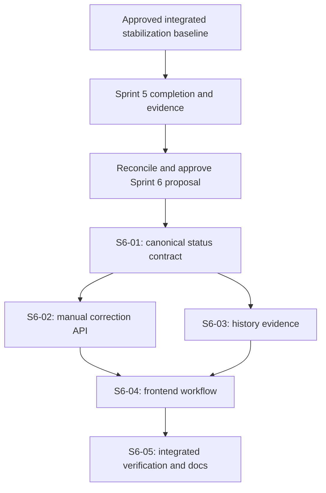

# Sprint 6 proposal — User-controlled application status and explainable history

Status: reviewed local proposal, 2026-09-26. Ticket text incorporates the planning-review corrections. Product approval, Sprint 5 closure, implementation, migrations, runtime tests, and live verification are still pending. S6-01 through S6-05 are local planning IDs, not Linear identifiers. No authoritative historical Sprint 6 ticket set is assumed.

Start with the [current-state assessment](architecture-review.md), then the five tickets, the [verification runbook](verification-runbook.md), and the [review resolutions](planning-review.md). The complete ticket bodies are the engineering handoff; the [Linear migration package](linear-conversion.md) explains their conversion.

## A. Sprint 6 goal

A user can inspect an application, distinguish AI inference from their own confirmed status, correct that status safely, and understand the source and timing of recorded application activity.

This implements the existing [UF-09 manual correction requirement](../../product/user-flows.md) and strengthens UF-07. The [domain model](../../domain/domain-model.md) explicitly defines effective status as `userStatus ?? aiStatus`. Completion of this scope does not mean all MVP gaps are closed.

## B. Why this sprint follows Sprint 5

Reliable ingestion must precede a product workflow that relies on its output. A [Sprint 5 draft](../sprint-5/README.md) now exists. It is unexecuted and its ticket identifiers require the reconciliation described in its [conversion notes](../sprint-5/linear-conversion.md). Do not describe that draft as completed history or assume the stabilization audit already satisfies it.

The reviewed Sprint 5 order is baseline/readiness → recovery fixes → diagnostics → local worker/browser verification → live Gmail incremental proof. Its [planning review](../sprint-5/planning-review.md) corrects earlier dependency and fixture-safety details. Use the completed versions of that work rather than rebuilding or weakening it in Sprint 6.

### Entry gate for every Sprint 6 ticket

- Establish the approved integrated stabilization baseline and actual deployed API/worker versions; old workers must not bypass durable claims.
- Close the Sprint 5 crash-retry, stale-write/finalization, transport-bound, diagnostic, and browser-refresh requirements with executable evidence.
- Preserve the measured original dataset, approximately 1,620 emails according to the supplied brief; verify identities and existing user decisions, not just a total count.
- Link the final real Gmail incremental/repeat-sync evidence and real local worker/domain/browser evidence. Live Gemini/Discord success is supplementary to Sprint 5's mandatory Gmail proof; record actual downstream state and unresolved operations. Separate stabilization deployment gates still apply where relevant.
- Reconcile this proposal against the final Sprint 5 source/contracts/harness and record final commit IDs. No database/provider access or prior successful test log substitutes for this step.
- Record approval of Sprint 6's proposed clear-override, revision, and history-presentation decisions before implementation.

## C. Current-state capability matrix

The [architecture review](architecture-review.md) contains the full matrix and source inventory. In the inspected code, list/detail status precedence diverges; manual correction is missing; source metadata is absent from timeline responses. AI claims and incremental ingestion mechanisms exist, but known Sprint 5 recovery findings remain open. Runtime readiness has not been reverified by creating these documents.

## D. Remaining technical and product gaps

The [gap analysis](architecture-review.md) separates P0 entry gates, P1 risks, P2 limitations, future work, product gaps, and technical-debt disposition. User correction does not repair incorrect matching, make AI dates reliable, or supply an interview agenda. Those limitations remain explicit after this sprint.

## E. Proposed scope and decisions

Included: one effective-status contract; manual set/change/clear with concurrency protection; owned source metadata and honest recording-time labels; focused UI/error recovery; integration verification; documentation.

Proposed rules:

1. `userStatus` remains authoritative until the user explicitly clears it. Clearing means use persisted AI state, or unknown when none exists; it does not rerun AI.
2. A dedicated `userStatusRevision` protects manual changes. The editor freezes the revision when editing begins; background refresh cannot silently rebase a draft.
3. AI and user status disagreement is informational. AI inference continues to update independently without changing manual fields.
4. History remains in recording order. Email date, recording time, and actual recruitment-event occurrence are different concepts. This sprint adds no invented occurrence time.
5. Manual corrections update Application's latest correction provenance, not recruitment events, following the existing domain decision. Clearing removes the current confirmation timestamp; full edit history is not promised.
6. A status correction does not resolve actions or send notifications. This effect is stated in the editor.
7. Application response schemas are validated at runtime. Missing contract fields are an error, not a valid unknown status.

Non-goals: AI/model/prompt/version changes; historical replay or operation resets; replacing AI transitions; event-time reconstruction; agenda/date normalization; silent-application detection; automatic application creation; rematching/merging; action obsolescence; search/dashboard redesign; notification outbox; retention implementation; broad restyling. No Outlook, LinkedIn, Slack, Telegram, WhatsApp, teams, billing, SSO, extra AI providers, or infrastructure.

## F. Ticket list

| Local ID / title | Repositories | Priority | Estimate | Dependencies |
| --- | --- | --- | --- | --- |
| [S6-01 — Unify effective application status across API and UI](S6-01.md) | backend, frontend | High | 3 | Sprint 5 entry gate |
| [S6-02 — Add concurrency-safe manual application status correction](S6-02.md) | backend, coordinated frontend contract fixtures | High | 5 | S6-01 |
| [S6-03 — Expose owned source evidence and recording semantics in application history](S6-03.md) | backend, coordinated frontend contract fixtures | Normal | 3 | S6-01 |
| [S6-04 — Deliver the application status correction and evidence-review workflow](S6-04.md) | frontend | High | 5 | S6-01, S6-02, S6-03 |
| [S6-05 — Verify the complete status workflow and publish its operating contract](S6-05.md) | backend, frontend, docs | High | 3 | S6-01–04 |

Total: 19 provisional relative points, not a calendar commitment. Re-estimate against the final Sprint 5 diff and team capacity. Suggested labels/priorities are not claims about Linear configuration.

## G. Dependency graph

S6-02 and S6-03 can proceed independently after S6-01. Coordinate edits to their shared application contract and mapper; keep synchronized frontend fixtures compiling with each contract change. Every ticket owns its focused tests; S6-05 supplies integrated acceptance rather than deferring all testing to the end.

## H. Definition of done

- [ ] Entry gate and approved baseline are recorded.
- [ ] All 64 combinations of seven AI/user statuses plus null follow one canonical precedence rule.
- [ ] User can set/change/clear status; AI disagreement cannot overwrite confirmed state.
- [ ] Draft revision remains frozen across background refresh; stale edits receive 409.
- [ ] Stale reads cannot overwrite an acknowledged correction; uncertain writes are reconciled without automatic resubmission.
- [ ] Missing/malformed required contract fields show a recoverable error and disable editing; true null remains valid unknown.
- [ ] Recording time and email date are separately labeled; source metadata is owned and bounded.
- [ ] Manual correction produces zero Gmail/Gemini/Discord calls and zero enqueued jobs.
- [ ] Completed AI work reuses existing results without additional provider calls; no historical replay/reset is introduced.
- [ ] Guarded fresh/upgrade checks preserve existing records, choices, constraints, and ownership protections.
- [ ] Final Sprint 5 real-worker browser coverage remains intact, including fixture safety and cleanup. Sprint 6 scenarios pass on the extended harness.
- [ ] Focused/full tests, typecheck, lint, build, contract sync, and desktop/mobile keyboard checks pass with evidence.
- [ ] Documentation states delivered behavior and unresolved MVP limits accurately. No synthetic test is called live-provider evidence.

Commands, guard ordering, mutation recovery, and test lanes are in the [verification runbook](verification-runbook.md).

## I. Risk register

| Risk | Mitigation / acceptance gate | Owner |
| --- | --- | --- |
| Sprint 5 changes invalidate current assumptions | Reconcile final code and rerun affected checks before approval | Architecture / sprint owner |
| Starting from unstabilized or mixed workers | Verify integrated/deployed commit IDs; preserve claim boundaries | Release owner |
| Background refetch silently rebases an editor | Freeze draft revision; explicit conflict review; regression test | Frontend |
| Concurrent manual writes overwrite each other | Owned row lock and revision compare before no-op/write | Backend |
| Lost mutation response or stale GET misleads user | Cancel reads, validate responses, refetch; preserve unknown outcome if recovery fails | Frontend / QA |
| Migration points at preserved or unintended DB | Explicit target plus shared guard before CLI; verify fixture provenance; reject mismatched .env.test | Backend / QA |
| Sprint 6 regresses Sprint 5 harness into fake completion | Extend real-worker fixture harness, preserve external-call blocking and safe teardown | QA |
| Source metadata leaks or looks like verified model reasoning | Owner-checked selection; plain-text rendering; separate AI interpretation label | Backend / frontend |
| Email date is mistaken for actual interview/event time | Separate labels and explicit unknowns; no inferred occurrence column | Frontend |
| Rollback restores AI-first display | Retain S6-01 and stored corrections; disable editor without undoing data | Release owner |
| Scope expands into full MVP completion | Keep agenda, matching, retention, search, and inference redesign outside acceptance | Sprint owner |

## J. Documentation updates during implementation

| Existing file in docs unless qualified | Required change |
| --- | --- |
| [Domain model](../../domain/domain-model.md) | Canonical status fields, manual revision/clear/no-op semantics, latest-only provenance, actual history boundary |
| [User flows](../../product/user-flows.md) | UF-07 evidence presentation; UF-09 edit conflict, draft, clear and uncertain-save behavior |
| [MVP architecture](../../architecture/mvp-architecture.md) | Status read/write boundary, source selection, remaining inference/date limits |
| [Email AI pipeline](../../architecture/email-ai-pipeline.md) | Reconcile stale upsert-only replay claims with completed Sprint 5/stabilization docs; preserve operation claims |
| [High-level architecture](../../architecture/high-level-architecture.md) | Mark affected superseded implementation descriptions historical; link current architecture |
| backend [README](../../../../career-companion-backend/README.md) | New API, errors, revision rules, guarded verification commands |
| backend [STABILIZATION](../../../../career-companion-backend/STABILIZATION.md) | Additive migration, rollout and safe rollback; preserve final Sprint 5 harness description |
| frontend [README](../../../../career-companion-frontend/README.md) | Contract sync/runtime validation and new smoke scenarios |
| [Design system](../../DESIGN_SYSTEM.md) | Document a new primitive only if introduced |
| [Stabilization audit](../../engineering/stabilization-audit.md) | Preserve dated evidence; clarify no authoritative historical Sprint 6 set existed |
| [Readiness report](../../../MVP-READINESS-REPORT.md) | New observed evidence and remaining MVP gaps, without declaring production readiness from fixtures |

These are implementation follow-ups. Creating this proposal does not rewrite shipped architecture documents as if the features already exist.

## K. Linear migration package

Use the [migration package](linear-conversion.md). Paste each complete 21-section ticket as its description, preserve acceptance checkboxes, attach the shared runbook and assessment, then map local dependency IDs after actual issue creation. No Linear changes are authorized by saving these local documents.
