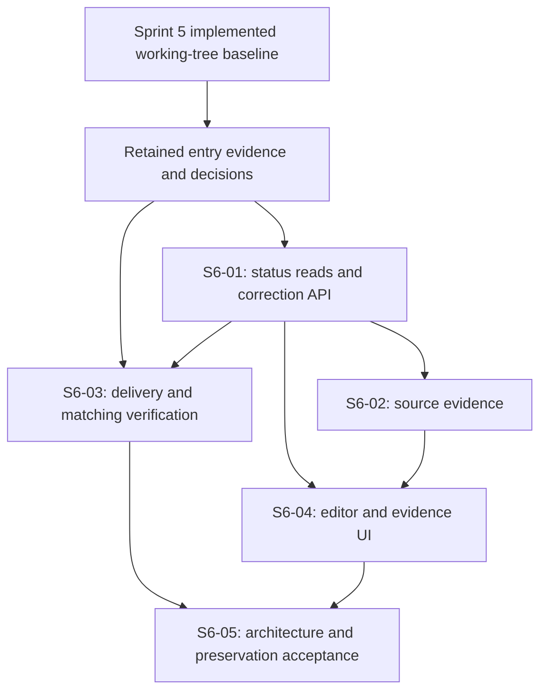

# Sprint 6 execution contract — User-controlled application status and explainable history

Status: authoritative reconciled **local planning contract**, 2026-09-27. Sprint 6 implementation has not begun. The five ticket bodies below define requirements; this overview defines allocation, shared gates and open decisions. The runbook defines verification. Review/assessment documents retain traceability and evidence boundaries, not a competing allocation. S6-01–S6-05 are local IDs; no Linear identity, state or approval is assumed.

This contract combines the detailed requirements from `58c426c^` with the reassigned scope introduced by `58c426c`. The [reconciliation record](planning-review.md) maps surviving requirements and corrected claims. An unresolved product decision is a visible stop on its affected scope, not permission to guess or silently delete it.

Read the [baseline assessment](architecture-review.md), five tickets, [verification runbook](verification-runbook.md) and [review record](planning-review.md). The [conversion notes](linear-conversion.md) reference these same ticket bodies without maintaining duplicate requirements.

## A. Sprint 6 goal

A user can inspect an application, distinguish AI inference from their own confirmed status, correct that status safely, and understand the source and timing of recorded application activity.

This implements the existing [UF-09 manual correction requirement](../../product/user-flows.md) and strengthens UF-07. The [domain model](../../domain/domain-model.md) explicitly defines effective status as `userStatus ?? aiStatus`. Completion of this scope does not mean all MVP gaps are closed.

## B. Why this sprint follows Sprint 5

Sprint 5 is implemented and regression-reviewed in the **current uncommitted migrated working tree**. Its [execution report, including follow-up fixes](../sprint-5/execution-report.md) and [operations](../sprint-5/operations.md) supersede earlier descriptions of an unexecuted draft. Preserve the Gmail fencing/recovery/transport work, safe AI retry, telemetry, bounded cross-route refresh, 15-second client deadline and real-worker harness. Do not start from HEAD alone or discard these changes to get a clean checkout.

### Entry gate for every Sprint 6 ticket

The existing gate is retained; this documentation-only reconciliation neither executes it nor silently waives it:

- Record baseline HEAD **plus uncommitted diff/untracked source identity** for backend/frontend/docs, reconcile against the Sprint 5 execution report, and preserve that engineering baseline. When implementation is later committed, record resulting commits; a new commit is not required for this documentation task.
- Link existing Sprint 5 executable evidence for crash/retry, stale-write/finalization fencing, bounded transport, diagnostics, retry fixes and browser refresh. Reverify affected behavior when the implementation changes; do not label that delivered work unimplemented.
- Preserve the historical approximately 1,620-email dataset and existing decisions using identity/field comparisons. The execution report says that dataset is unavailable here; the local preserved database was empty. Synthetic volume does not satisfy this evidence gate.
- Link real Gmail incremental/repeat-sync and original-data preservation evidence plus local real-worker/domain/browser evidence. Real Gmail/original-data evidence is still unverified. Live Gemini/Discord success remains supplementary to this Gmail requirement; independent stabilization deployment/provider gates remain separate.
- Establish the approved integrated stabilization baseline and actual deployed API/worker versions as required by the retained entry gate; older workers must not bypass durable claims. This runtime/deployment evidence is not supplied by local engineering completion or this rewrite.
- Resolve D1 and record the inherited approval of clear-override, revision and history-presentation decisions in D2 before their dependent implementation. See [open decisions](#l-open-decisions-and-readiness).

No Gmail, Gemini, Discord or database access is required merely to reconcile these documents. Starting implementation while the retained entry evidence is unavailable would require an explicit change to that gate by its owner, not an inference from Sprint 5 engineering completion.

## C. Current-state capability matrix

The [architecture review](architecture-review.md) separates confirmed source facts, reported Sprint 5 runtime evidence, suspected S6-03 risks and pending checks. List/detail status precedence still diverges; the manual correction endpoint/revision and history source response fields are absent. Sprint 5 reliability and real-worker verification are present. Installed pg-boss uses batchSize=1: `jobs[0]` alone is not a demonstrated batch-loss defect.

## D. Remaining technical and product gaps

The [gap analysis](architecture-review.md) separates P0 entry gates, P1 risks, P2 limitations, future work, product gaps, and technical-debt disposition. User correction does not repair incorrect matching, make AI dates reliable, or supply an interview agenda. Those limitations remain explicit after this sprint.

## E. Surviving scope and contract rules

Included: one effective-status contract; manual set/change/clear with concurrency protection; owned source metadata and honest recording-time labels; focused UI/error recovery; worker-delivery and application-matching concurrency verification/hardening; final architecture/data-preservation verification; documentation. Action-response evidence scope is held at D1.

The existing detailed material specifies these rules; inherited product approval is still recorded as pending in D2:

1. `userStatus` remains authoritative until the user explicitly clears it. Clearing means use persisted AI state, or unknown when none exists; it does not rerun AI.
2. A dedicated `userStatusRevision` protects manual changes. The editor freezes the revision when editing begins; background refresh cannot silently rebase a draft.
3. AI and user status disagreement is informational. AI inference continues to update independently without changing manual fields.
4. History remains in recording order. Email date, recording time, and actual recruitment-event occurrence are different concepts. This sprint adds no invented occurrence time.
5. Manual corrections update Application's latest correction provenance, not recruitment events, following the existing domain decision. Clearing removes the current confirmation timestamp; full edit history is not promised.
6. A status correction does not resolve actions or send notifications. This effect is stated in the editor.
7. Application and event response schemas are validated at runtime. Missing contract fields are an error, not valid unknown/empty data. A malformed successful create response follows S6-01's creation recovery; it must not invite a blind repeat POST or automatic matching/deduplication.
8. Every delivered worker job has an attributable attempted outcome. Verify matching interleavings while preserving user decisions, per-email effect uniqueness and existing matching policy. Do not infer a present batch-loss failure from first-element access under single-job delivery.

Non-goals: AI/model/prompt/version changes; historical replay or operation resets; replacing AI transitions; event-time reconstruction; agenda/date normalization; silent-application detection; automatic application creation; rematching/merging; action obsolescence; search/dashboard redesign; notification outbox; retention implementation; broad restyling. No Outlook, LinkedIn, Slack, Telegram, WhatsApp, teams, billing, SSO, extra AI providers, or infrastructure.

## F. Ticket list

| Local ID / canonical title | Scope owner | Dependencies |
| --- | --- | --- |
| [S6-01 — Establish application status semantics and manual user correction](S6-01.md) | Canonical API/UI reads, runtime validation and create-response recovery, revision/PATCH, guarded additive migration | Common entry gate and D2 |
| [S6-02 — Record source email evidence for timeline events and AI actions](S6-02.md) | Owned event/recentEvent evidence, recording semantics, runtime validation; action-response scope held at D1 | S6-01 shared response contract; D1/D2 |
| [S6-03 — Verify and harden AI worker delivery and application matching concurrency](S6-03.md) | Delivery invariant, verified concurrency behavior and bounded necessary fixes | Common entry gate; S6-01 for final manual-field interaction |
| [S6-04 — Deliver the application status correction and evidence-review workflow](S6-04.md) | Frozen draft/editor, conflict/uncertain-save recovery, evidence presentation | S6-01/02; D1/D2 for affected UI |
| [S6-05 — Final architecture and data-preservation verification for Sprint 6](S6-05.md) | Integrated tests, architecture boundaries, fresh/upgrade preservation, operating docs | S6-01–04 and retained entry evidence |

The earlier 19-point total covered a different allocation and omitted the new worker/matcher scope. Preserve it as historical planning evidence only; re-estimate these five tickets rather than transferring or inventing points. Priorities/labels remain suggestions, not Linear configuration or state.

## G. Dependency graph

```mermaid
flowchart TD
    S5[Sprint 5 implemented working-tree baseline] --> G[Retained entry evidence and decisions]
    G --> A[S6-01: status reads and correction API]
    G --> C[S6-03: delivery and matching verification]
    A --> E[S6-02: source evidence]
    A --> U[S6-04: editor and evidence UI]
    E --> U
    A --> C
    C --> V[S6-05: architecture and preservation acceptance]
    U --> V
```

S6-03 investigation can run alongside S6-01/02; its final manual-revision interaction depends on S6-01. S6-04 needs S6-01/02 contracts, not a new S6-03 API. Every ticket owns focused verification; S6-05 does not defer all tests to the end. Shared mapper/schema edits must keep frontend fixtures synchronized. All arrows inherit the common entry gate; unresolved decisions block only the affected design but prevent declaring the whole sprint ready.

## H. Definition of done

- [ ] Entry gate and approved baseline are recorded.
- [ ] All 64 combinations of seven AI/user statuses plus null follow one canonical precedence rule.
- [ ] User can set/change/clear status; AI disagreement cannot overwrite confirmed state.
- [ ] Draft revision remains frozen across background refresh; stale edits receive 409.
- [ ] Stale reads cannot overwrite an acknowledged correction; uncertain writes are reconciled without automatic resubmission.
- [ ] Malformed/lost successful creation preserves the draft and reconciles owned reads without blind repeat POST or automatic deduplication.
- [ ] Missing/malformed required contract fields show a recoverable error and disable editing; true null remains valid unknown.
- [ ] D1/D2 decisions are recorded and reflected in tickets, conversion and verification.
- [ ] S6-03 delivery and distinct-email/matching race scenarios pass with facts separated from suspected risks.
- [ ] Final architecture boundaries and accepted limitations are reviewed as required by S6-05.
- [ ] Recording time and email date are separately labeled; source metadata is owned and bounded.
- [ ] Manual correction produces zero Gmail/Gemini/Discord calls and zero enqueued jobs.
- [ ] Completed AI work reuses existing results without additional provider calls; no historical replay/reset is introduced.
- [ ] Guarded fresh/upgrade checks preserve existing records, choices, constraints, and ownership protections.
- [ ] Final Sprint 5 real-worker browser coverage remains intact, including fixture safety and cleanup. Sprint 6 scenarios pass on the extended harness.
- [ ] S6-05 extends the current harness lifecycle so new HTTP/worker intake stops and in-flight handlers are quiescent before fixture deletion; failed drain skips destructive cleanup.
- [ ] Focused/full tests, typecheck, lint, build, contract sync, and desktop/mobile keyboard checks pass with evidence.
- [ ] Documentation states delivered behavior and unresolved MVP limits accurately. No synthetic test is called live-provider evidence.

Commands, guard ordering, mutation recovery, and test lanes are in the [verification runbook](verification-runbook.md).

## I. Risk register

| Risk | Mitigation / acceptance gate | Owner |
| --- | --- | --- |
| Uncommitted Sprint 5 work is omitted from baseline | Capture working-tree identity and preserve implemented regression fixes | Architecture / sprint owner |
| Starting from unstabilized or mixed workers | Verify integrated/deployed commit IDs; preserve claim boundaries | Release owner |
| Background refetch silently rebases an editor | Freeze draft revision; explicit conflict review; regression test | Frontend |
| Concurrent manual writes overwrite each other | Owned row lock and revision compare before no-op/write | Backend |
| Lost mutation response or stale GET misleads user | Cancel reads, validate responses, refetch; preserve unknown outcome if recovery fails | Frontend / QA |
| Migration points at preserved or unintended DB | Explicit target plus shared guard before CLI; verify fixture provenance; reject mismatched .env.test | Backend / QA |
| Sprint 6 regresses Sprint 5 harness into fake completion | Extend real-worker fixture harness, preserve external-call blocking and safe teardown | QA |
| Source metadata leaks or looks like verified model reasoning | Owner-checked selection; plain-text rendering; separate AI interpretation label | Backend / frontend |
| Email date is mistaken for actual interview/event time | Separate labels and explicit unknowns; no inferred occurrence column | Frontend |
| Rollback restores AI-first display | Retain S6-01 and stored corrections; disable editor without undoing data | Release owner |
| Scope expands into full MVP completion | Keep agenda, rematching/merging, retention, search, and inference redesign outside acceptance; S6-03 matching concurrency is included | Sprint owner |

## J. Documentation updates during implementation

| Existing file in docs unless qualified | Required change |
| --- | --- |
| [Domain model](../../domain/domain-model.md) | Canonical status fields, manual revision/clear/no-op semantics, latest-only provenance, actual history boundary |
| [User flows](../../product/user-flows.md) | UF-07 evidence presentation; UF-09 edit conflict, draft, clear and uncertain-save behavior |
| [MVP architecture](../../architecture/mvp-architecture.md) | Status read/write boundary, source selection, remaining inference/date limits |
| [Email AI pipeline](../../architecture/email-ai-pipeline.md) | Reconcile stale upsert-only replay claims with completed Sprint 5/stabilization docs; preserve operation claims |
| [High-level architecture](../../architecture/high-level-architecture.md) | Mark affected superseded implementation descriptions historical; link current architecture |
| backend [README](../../../../career-companion-backend-main/README.md) | New API, errors, revision rules, guarded verification commands |
| backend [STABILIZATION](../../../../career-companion-backend-main/STABILIZATION.md) | Additive migration, rollout and safe rollback; preserve Sprint 5 harness and add verified S6-03 delivery/matching outcomes |
| frontend [README](../../../../career-companion-frontend-main/README.md) | Contract sync/runtime validation and new smoke scenarios |
| [Design system](../../DESIGN_SYSTEM.md) | Document a new primitive only if introduced |
| [Stabilization audit](../../engineering/stabilization-audit.md) | Preserve dated evidence; clarify no authoritative historical Sprint 6 set existed |
| [Readiness report](../../../MVP-READINESS-REPORT.md) | New observed evidence and remaining MVP gaps, without declaring production readiness from fixtures |

These are implementation follow-ups. Reconciling this planning contract does not rewrite shipped architecture documents as if the features already exist.

## K. Linear migration package

Use the [migration package](linear-conversion.md). Paste each complete 21-section ticket as its description, preserve acceptance checkboxes, attach the shared runbook and assessment, then map local dependency IDs after actual issue creation. No Linear changes are authorized by saving these local documents.

## L. Open decisions and readiness

| ID | Decision requiring an explicit owner response | Source and stop boundary |
| --- | --- | --- |
| D1 | Does S6-02 add source metadata to action responses/UI, or retain event/recentEvent enrichment and narrow the title? | `58c426c` adds “AI actions” to the title but no action DTO/acceptance requirements; earlier S6-03 defines only events/recentEvent; UF-08 requires action traceability without selecting a surface. Preserve existing associations. Stop on new action API/UI design; do not invent fields/endpoints or silently drop the promise. S6-02/04/05 cannot claim this point complete until decided. |
| D2 | Approve the already-documented clear/latest-only provenance, dedicated revision/conflict and recording-order history rules, or explicitly request changes. | The earlier overview/tickets require sign-off and no approval record was found. The rules in S6-01/02/04 are the reconciled proposed contract, not evidence that approval occurred. Full correction audit/history reconstruction remains excluded unless scope is explicitly changed. |

No new product policy is selected here. The remaining runtime/source-evidence gates are verification work, not invented product decisions. If unavailable evidence necessitates changing an entry gate, that is an explicit owner decision; this contract preserves the existing gate.

**Readiness:** allocation and surviving engineering requirements are reconciled. The pack is sufficient to review and execute the resolved scope once the decisions and entry gates pass; it is **not yet authorization or an unconditional green light to begin Sprint 6 implementation**. No Sprint 6 acceptance checkbox is marked complete from this documentation review.
