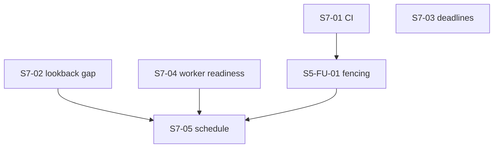

# Sprint 7 — Reliable Gmail ingestion

Status: **implemented locally on the office laptop (2026-10-03); remote CI and live scheduled-use acceptance pending.** The owner authorized continuation from GitHub independently of personal-Mac verification. See [execution evidence](execution-report.md). Local IDs; no Linear identity, state or estimate is assumed. Part of the [roadmap](../README.md).

| Field | Value |
| --- | --- |
| Sprint number | 7 |
| Sprint name | Reliable Gmail ingestion |
| Size | 6 tickets: 1 L, 4 M, 1 S. About 3 weeks for one developer. |
| Repositories | backend (main); frontend for CI, the Gmail page and deadline display |

## 1. Goal

No job email is silently skipped, falsely reported as synced, or given an invented date between Gmail and the Action Center, and Gmail sync runs twice a day without a click. Every change runs through CI.

## 2. Why this sprint exists

The golden path is **Gmail → Sync → Email → Queue → Worker → AI → AI Result → Matching → Actions → UI**. After the closeout, the largest confirmed risks sit at its start:

- **Silent mail loss.** When the time since the last successful sync is longer than the lookback (default 1 day), the sync only asks Gmail for the last N days and then moves its checkpoint past the gap. Mail in the gap is never ingested and nothing reports it (`gmailSync.ts`).
- **False success after a crash.** A sync killed mid-run is retried by pg-boss with a stale claim, throws `SyncInProgressError`, and the job is acknowledged as done with nothing synced. A superseded attempt can still insert rows and log success (S5-FU-01 G1/G2).
- **Invented dates.** An AI deadline written without a year ("by Nov 20") is stored as 2001 and shows as Overdue in the Action Center and in Discord.
- **Dead workers look healthy.** If PostgreSQL is not up when the backend boots, all workers fail once and never register, while `/health` keeps returning 200.
- **No scheduled sync.** The owner locked a twice-daily sync on 2026-10-01. It is not built and had no ticket. It is also what resumes emails waiting for AI after a cooldown.
- **No CI.** 775 tests run only when someone runs them by hand.

These are correctness and reliability defects on the product's main input, confirmed in the current code. Fixing them is what makes the product usable day to day.

## 3. Scope

Included:

- CI for both code repos and toolchain pins (S7-01).
- The lookback-gap fix (S7-02).
- Safe deadline parsing at the matcher boundary, without changing the AI contract (S7-03).
- Worker start-up retry or loud failure, and a readiness signal (S7-04).
- Sync fencing and crash recovery, with minimal start/terminal sync events (S5-FU-01, rescoped).
- The twice-daily schedule with a start-up catch-up and last/next sync on the Gmail page (S7-05).

## 4. Non-goals

- No deployment, Docker image, edge routing or infrastructure code.
- No AI provider certification, catalog change, prompt change or extraction contract version bump.
- No agenda view and no general date normalization (only the minimal deadline fix).
- No rematching or unlink of emails (Sprint 8).
- No bounded Google transport rewrite (S5-FU-02, Sprint 8), no full sync counter equations, no snapshot tooling (FU-5).
- No Gmail push (Pub/Sub), per-user timezones or user-editable schedules.
- No notification outbox, cursor pagination or UI redesign.
- No new COM numbers.

## 5. Dependencies

- Phase 0 gate passed; Sprint 6 closeout exit criteria met.
- Git restored and pushed (CI needs a remote).
- Owner decisions: OD-04 before S7-02, OD-06 before S7-03, OD-05 before S7-05 ([roadmap §6](../README.md#6-owner-decisions)).
- Until S7-02 ships, keep the Gmail lookback at 30 days (interim step MV-12).

## 6. Ordered tickets

| Order | ID | Title | Size | Depends on |
| --- | --- | --- | --- | --- |
| 1 | [S7-01](S7-01-ci-and-toolchain-pins.md) | Minimal CI for backend and frontend, with toolchain pins | M | Git remote |
| 2 | [S7-02](S7-02-no-silent-mail-loss-after-gaps.md) | Never skip mail when the gap since the last sync is longer than the lookback | M | OD-04 |
| 3 | [S7-03](S7-03-safe-action-deadlines.md) | Store AI action deadlines only when the date is clear | M | OD-06 |
| 4 | [S7-04](S7-04-worker-startup-and-readiness.md) | Background workers recover or fail loudly, and report readiness | S | — |
| 5 | [S5-FU-01](../sprint-5/follow-up-gmail-reliability.md) | Gmail sync fencing and crash recovery (existing, rescoped: FU-1, FU-4.1, FU-4.2, FU-4.4, minimal events) | L | S7-01 (CI before the large change) |
| 6 | [S7-05](S7-05-twice-daily-scheduled-sync.md) | Twice-daily scheduled Gmail sync | M | S5-FU-01, S7-02, S7-04, OD-05 |

S7-01 and S7-02 can run in parallel. S7-05 is last: a scheduler must not run on a sync that a crash can silently skip, on a lookback that silently drops mail, or on workers that can be silently dead.

## 7. Exit criteria

- [ ] S7-01: CI runs on every push and pull request in backend and frontend and is green on main; `engines` and `.nvmrc` are set; no doc claims CI that does not exist.
- [x] S7-02 (local evidence): a regression test with a stale `lastSyncedAt` proves every INBOX message since the last successful sync (up to 30 days) is ingested; the Gmail page says so when the cap cut mail.
- [x] S7-03 (local evidence): yearless or unclear deadlines are never stored as a past year; date-only deadlines show without an invented time, in the UI and in Discord.
- [x] S7-04 (local evidence): a worker start failure retries and then exits non-zero; readiness reports registered workers; the placeholder health test is replaced.
- [x] S5-FU-01 (local evidence): the SIGKILL/redelivery regression passes in its own crash lane; a superseded or disconnected attempt cannot insert, advance the checkpoint or log success.
- [ ] S7-05: scheduled runs at 00:00 and 18:00 in the decided timezone sync every connected user once, skip busy ones, catch up once after a missed slot, and resume emails waiting for AI; the Gmail page shows last and next sync; **observed on two real days of use**, not only in tests.
- [x] Local backend and frontend suites, the migration lanes (if a migration was added) and the smoke pass; results and counts are recorded in a dated `execution-report.md` in this folder. Nothing synthetic is called live evidence.

## 8. Risks

| Risk | Mitigation |
| --- | --- |
| FU-1 fencing is larger than expected | It is the only L ticket; CI lands first; the scheduler waits for it. |
| Scheduler double-runs with a manual sync | Reuse `requestGmailSync` and its lease; a busy user is a skip, not a failure. |
| Wider lookback after a long gap costs AI calls on the user's key | The 30-day cap and the per-user safety limit still apply; the notice tells the user. |
| The PC is off at 00:00 | Start-up catch-up (OD-05) plus the S7-02 gap fix. |
| Deadline year inference picks the wrong year | Only month-day text is inferred, from the email's received date; anything else unclear is stored as null. |
